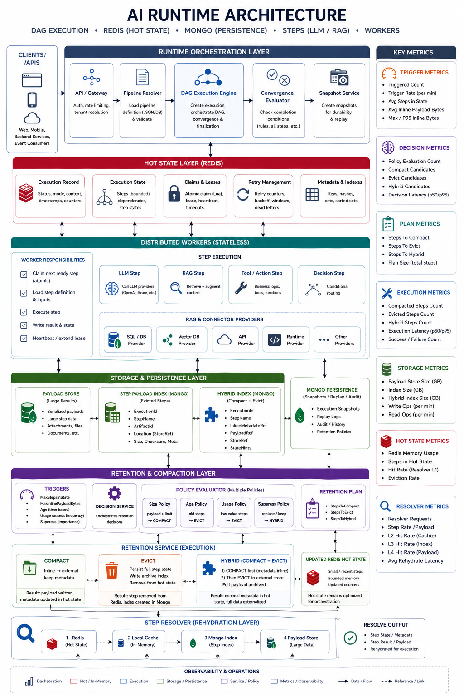
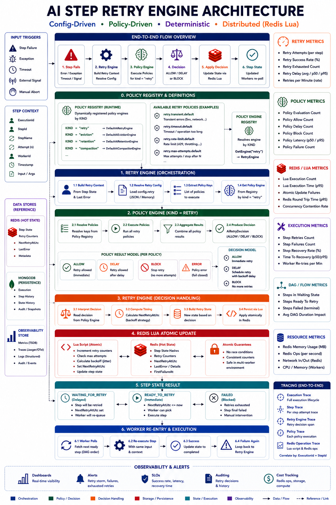
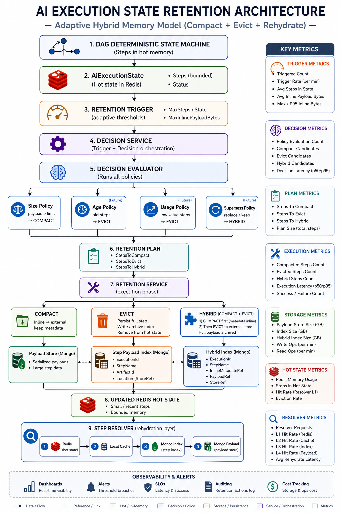
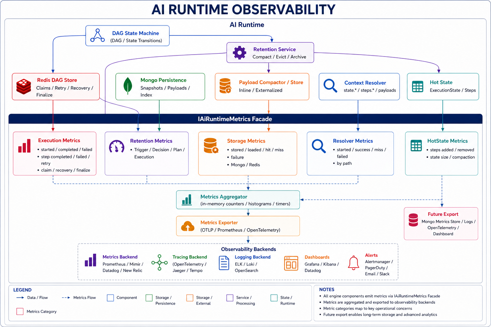

# Multiplex AI Runtime
A Multiplexed, Deterministic Execution Layer for Multi-Tenant AI Systems  

Distributed • State-Driven • Fault-Tolerant • Observable
---

This repository provides a **reference implementation of a multiplexed, deterministic AI runtime**, demonstrating how to build **distributed, observable, and fault-tolerant execution systems for production-grade AI workloads**.

[](./CHANGELOG.md)
[](./CHANGELOG.md)

---

### Runtime


---

### Infrastructure


---

### Messaging


---

### Languages


---

### License

This project is licensed under the **Business Source License 1.1 (BSL)**.

- Free for development, testing, and internal use
- Commercial production use requires a license
- Automatically converts to Apache 2.0 on 2029-01-01

**This project is still under active development. Some features may be incomplete and UI or functional issues may occur.**

---

## Introduction

Multiplex AI Runtime is a deterministic, distributed execution runtime for building production-grade AI workflows.

It is designed to execute complex pipelines such as LLM workflows, RAG pipelines, decision steps, tool execution, and long-running AI processes with strong guarantees around state consistency, retry safety, recovery, memory control, and observability.

This project is not positioned as a simple RBAC library anymore. The RBAC runtime remains an important subproject, but the main focus of this repository is now the AI Runtime: a system-level execution layer for reliable AI orchestration.

The goal of Multiplex AI Runtime is to move AI systems from prototype-style execution into production-grade infrastructure where workflows can be distributed, monitored, recovered, replayed, compacted, and reasoned about safely.

In short:

> Multiplex AI Runtime is not just about calling AI providers.  
> It is about controlling execution, state, memory, and failure in distributed AI systems.

---

## What is Multiplex AI Runtime?

Multiplex AI Runtime is a **deterministic execution engine for AI workflows** designed to run complex pipelines safely in distributed environments.

At its core, it is a **state-driven runtime** that orchestrates execution using a combination of:
- DAG-based workflow modeling
- Redis-backed distributed state
- MongoDB persistence
- Stateless workers
- Deterministic execution rules

---

### From “Calling AI” to “Running AI Systems”

Most AI implementations today focus on:
- calling an LLM
- chaining prompts
- integrating APIs

While this works for simple use cases, it quickly breaks down when workflows become:
- multi-step
- parallel
- long-running
- failure-prone

Multiplex AI Runtime shifts the perspective:

> Instead of executing AI steps, it **runs AI systems**.

This means:
- execution is tracked
- state is persisted
- failures are handled
- retries are controlled
- results are reproducible

---

### A Runtime, Not a Framework

Multiplex is not just a developer-facing abstraction layer.

It behaves like a **runtime system**, similar in spirit to:
- a workflow engine
- a distributed state machine
- an execution coordinator

But specifically designed for **AI workloads**, where:
- data is large
- steps are heterogeneous (LLM, RAG, tools, decisions)
- failures are expected
- determinism is critical

---

### State as the Source of Truth

A key principle of the runtime is:

> **Execution is driven entirely by state.**

Every workflow execution is represented as:
- an execution record
- a set of step states
- associated inputs, outputs, and metadata

Workers do not “decide” what to do.

Instead:
- they read state
- they attempt atomic claims
- they execute assigned steps
- they write results back

This ensures:
- consistency across workers
- no duplicated execution
- deterministic behavior

---

### Built for Distributed Execution

The runtime is designed to run across multiple workers without coordination issues.

This is achieved through:
- Redis-based atomic operations (Lua scripts)
- claim tokens and leases
- retry scheduling
- recovery of abandoned work

As a result:
- multiple workers can safely process the same workflow
- failures do not corrupt execution
- the system remains consistent under concurrency

---

### Deterministic by Design

One of the strongest guarantees provided by the runtime is **deterministic convergence**.

Regardless of:
- execution order
- retry sequences
- worker distribution
- transient failures

👉 the final result of the workflow will always be the same.

This is made possible by:
- strict state transitions
- idempotent execution patterns
- centralized decision logic based on state

---

### Designed for Real AI Workloads

Multiplex AI Runtime supports workflows composed of different types of steps:

- **LLM Steps** → calling AI models (OpenAI, Azure, etc.)
- **RAG Steps** → retrieving and combining data from multiple sources
- **Tool / Action Steps** → executing business logic or external integrations
- **Decision Steps** → conditional routing and branching

These steps can be combined into complex DAGs with dependencies, parallelism, and data flow between them.

---

### More Than Execution: Control, Memory, and Observability

The runtime does not stop at execution.

It also provides:
- **memory control** through retention and compaction
- **payload externalization** for large data
- **rehydration mechanisms** to reload data when needed
- **metrics and observability** across all layers

This transforms the system from a simple executor into a **fully managed AI execution platform**.

---

### Summary

Multiplex AI Runtime can be summarized as:

> A deterministic, distributed, state-driven runtime for executing AI workflows reliably at scale.

It enables developers and architects to:
- design complex AI pipelines
- run them safely in distributed environments
- control memory and cost
- observe and debug execution
- guarantee consistent results

This is the foundation required to move from experimental AI usage to **production-grade AI systems**.

---

## Why This Runtime Exists

The motivation behind Multiplex AI Runtime comes from a simple observation:

> Building AI features is easy. Running them reliably at scale is not.

---

### The Gap Between Prototypes and Production

Most AI systems start as simple prototypes:
- a prompt
- an API call
- a response

This works well for:
- demos
- experiments
- small-scale use cases

But as soon as the system evolves into something real, new challenges appear:

- multiple steps depending on each other
- parallel execution
- integration with external systems
- large and growing data
- failures happening at any point in the workflow

At this stage, the system is no longer just “calling AI” — it becomes a **distributed execution problem**.

---

### The Reality of AI Workflows

In production, AI workflows are:

- **multi-step** → pipelines with dependencies (DAGs)
- **stateful** → intermediate results must be preserved
- **failure-prone** → LLMs, APIs, and networks fail regularly
- **data-heavy** → large payloads and context accumulation
- **long-running** → workflows can span minutes or more

Without proper infrastructure, this leads to:

- inconsistent results
- duplicated execution
- corrupted state
- uncontrolled memory growth
- high operational cost
- impossible debugging

---

### Why Traditional Approaches Fail

Most existing approaches rely on:

- in-memory execution
- simple retry loops
- linear step chaining
- implicit state

These approaches assume:
- a single process
- no concurrency issues
- limited failure scenarios
- small data

👉 These assumptions break immediately in real-world environments.

---

### The Missing Layer: Execution Runtime

What is missing in most AI stacks is a **true execution runtime**.

Something that:

- understands workflow structure
- tracks execution state explicitly
- coordinates distributed workers
- enforces correctness rules
- manages memory and storage
- provides observability

Multiplex AI Runtime is designed to fill this gap.

---

### From “Functions” to “Systems”

The key shift is conceptual:

- Instead of thinking in terms of functions or steps  
  → think in terms of **systems with state and lifecycle**

- Instead of executing logic directly  
  → **drive execution through state transitions**

- Instead of trusting execution order  
  → **guarantee deterministic convergence**

---

### Failure is Not an Edge Case

In distributed AI systems, failure is the norm:

- an LLM call times out
- a provider returns inconsistent data
- a worker crashes mid-execution
- a network request fails

Multiplex AI Runtime treats failure as a **first-class concern**:

- retries are controlled and deterministic
- recovery is automatic and safe
- state is never corrupted
- execution can continue from where it stopped

---

### Memory is a Hard Constraint

AI systems naturally generate large amounts of data:

- prompt context
- retrieved documents (RAG)
- intermediate results
- logs and metadata

Without control, memory usage grows unbounded.

Multiplex introduces:
- retention strategies
- payload externalization
- multi-layer storage

This ensures:
- predictable memory usage
- scalable workflows
- controlled infrastructure cost

---

### Observability is Mandatory

Another major gap in most AI systems is visibility.

Without observability:
- you cannot debug failures
- you cannot optimize performance
- you cannot control cost

Multiplex AI Runtime makes observability a core feature:
- every step is tracked
- every retry is recorded
- every retention decision is measurable

---

### Enabling Production-Grade AI Systems

Ultimately, this runtime exists to enable a transition:

> from experimental AI usage → to production-grade AI systems

This means:

- predictable execution
- reproducible results
- controlled resource usage
- safe distributed scaling
- full visibility into system behavior

---

### Summary

Multiplex AI Runtime exists because modern AI systems need more than APIs and prompts.

They need:

- a deterministic execution model
- distributed coordination
- failure handling
- memory management
- observability

It provides the missing infrastructure layer required to build **reliable, scalable, and maintainable AI systems**.

---

## Core Design Principles

Multiplex AI Runtime is built around a small set of strict design principles.  
These are not implementation details — they define how the system behaves under load, failure, and scale.

---

### 1. State is the Single Source of Truth

All execution is driven by **explicit, persisted state**.

Every workflow execution is represented as:
- an execution record
- a collection of step states
- associated inputs, outputs, and metadata

Workers do not hold authoritative data.

Instead:
- they read state
- they act on state
- they update state

👉 This ensures:
- consistency across workers
- recoverability after failure
- reproducibility of execution

---

### 2. Workers are Stateless

Workers are designed to be **disposable execution units**.

They:
- do not own the workflow
- do not maintain long-lived memory
- do not make global decisions

They simply:
1. read the current state
2. attempt to claim work
3. execute a step
4. write the result

👉 This enables:
- horizontal scaling
- fault tolerance
- safe multi-worker execution

---

### 3. Determinism Over Convenience

The system prioritizes **deterministic behavior** over ease of implementation.

This means:
- execution order does not affect results
- retries do not change outcomes
- failures do not introduce inconsistencies

To achieve this:
- state transitions are strictly controlled
- step execution is idempotent
- convergence is computed, not assumed

👉 The same input always produces the same final state.

---

### 4. Explicit State Transitions

Steps do not implicitly change state.

All transitions follow well-defined rules:

Ready → Running → Completed / Failed / WaitingForRetry


Each transition:
- is validated
- is persisted
- is observable

👉 This removes ambiguity and makes debugging possible.

---

### 5. Atomic Distributed Coordination

All critical operations are **atomic**.

This is achieved using Redis + Lua scripts for:
- step claiming
- retry scheduling
- failure handling
- recovery

👉 Guarantees:
- no double execution
- no race conditions
- consistent behavior across workers

---

### 6. Failure is a First-Class Concern

Failure is expected, not exceptional.

The system is designed to handle:
- LLM/API failures
- network issues
- worker crashes
- partial execution

Instead of failing the whole workflow:
- steps are retried
- execution is resumed
- state is preserved

👉 The system is resilient by design.

---

### 7. Memory Must Be Bounded

AI workflows generate large and growing data.

The runtime enforces **memory boundaries** through:
- retention policies
- compaction strategies
- payload externalization

👉 Hot memory (Redis) is always controlled and limited.

---

### 8. Separate Hot and Cold Data

Not all data has the same value.

The system separates:
- **hot state** (active execution, Redis)
- **cold data** (historical payloads, MongoDB)

👉 This allows:
- fast execution
- scalable storage
- cost optimization

---

### 9. Rehydration Instead of Over-Retention

Instead of keeping all data in memory:

- data is externalized when not needed
- reloaded only when required

The resolver loads data through layers:
- Redis → Cache → Mongo → Payload Store

👉 This enables:
- large workflows
- reduced memory pressure
- efficient data access

---

### 10. Observability is Built-In

The runtime is designed to be fully observable.

Everything is tracked:
- execution lifecycle
- retries and recovery
- retention decisions
- storage usage
- resolver behavior

👉 This allows:
- debugging
- performance tuning
- cost control

---

### 11. Separation of Concerns

The system clearly separates responsibilities:

- orchestration (execution engine)
- storage (Redis / Mongo)
- execution (workers)
- retention (memory management)
- resolution (data access)

👉 This makes the system:
- modular
- extensible
- maintainable

---

### 12. System-First Design

Multiplex AI Runtime is designed as a **system**, not a library.

This means:
- behavior is predictable
- components interact through well-defined contracts
- execution is controlled at runtime level

👉 The goal is not to simplify code,  
👉 but to guarantee correct system behavior.

---

### Summary

These principles define how the runtime operates under all conditions.

They ensure that:
- execution is reliable
- state is consistent
- failures are handled safely
- memory is controlled
- behavior is observable

Together, they form the foundation required to build **production-grade AI systems**.

---

## High-Level Architecture

Multiplex AI Runtime is organized as a layered runtime architecture.

Each layer has a specific responsibility and is intentionally separated from the others.

This separation allows the runtime to support:

- distributed execution
- deterministic convergence
- memory control
- observability

### Architecture Overview

The following diagram represents the full runtime architecture, including orchestration, distributed state, execution, storage, and memory management layers.



---

### Key Layers

At a high level, the runtime is composed of:

- Runtime Orchestration Layer  
- Distributed Hot State (Redis)  
- Stateless Workers  
- Storage and Persistence Layer  
- Retention and Compaction Layer  
- Resolver (Rehydration Layer)  
- Observability and Metrics  

Each of these layers is explained in detail in the following sections.

---

### 1. Client / API Layer

The entry point into the runtime.

Responsibilities:
- start executions
- pass initial state
- query execution status
- retrieve results

Important:
This layer does NOT contain execution logic.  
It delegates everything to the runtime.

---

### 2. Runtime Orchestration Layer

Responsible for:
- creating execution records
- initializing state
- loading pipelines
- coordinating execution engines

It acts as the bridge between external systems and the runtime core.

---

### 3. Pipeline Resolution Layer

Pipeline definitions are declarative.

Before execution, they are resolved into runtime structures:
- step mapping
- dependency graph
- executor binding
- input resolution

This ensures the execution engine works with a normalized model.

---

### 4. Execution Engine

The core of the runtime.

Responsibilities:
- evaluate DAG or sequential flow
- determine which steps are ready
- coordinate execution across workers
- trigger convergence checks

Important:
The engine does NOT execute steps itself.  
It orchestrates execution through state.

---

### 5. Distributed State Layer (Redis)

This is the most critical layer.

Stores:
- execution state
- step states
- claim tokens
- retry metadata

Used for:
- atomic coordination
- distributed safety
- execution tracking

All workers rely on this layer to make decisions.

---

### 6. Distributed Workers

Workers are stateless executors.

They:
- read state
- claim steps
- execute logic (LLM, RAG, tools)
- write results back

They do not control execution flow.  
The state does.

---

### 7. Persistence Layer (MongoDB)

Used for:
- storing large payloads
- execution snapshots
- replay support
- historical tracking

This allows long-running workflows and debugging.

---

### 8. Retention & Compaction Layer

Controls memory usage.

Responsibilities:
- evaluate retention triggers
- decide which steps to compact or evict
- externalize payloads

Ensures Redis memory stays bounded.

---

### 9. Resolver (Rehydration Layer)

Loads data when needed.

Resolution order:
- Redis (hot)
- cache
- Mongo index
- payload store

Allows large workflows without keeping everything in memory.

---

### 10. Observability Layer

Provides full visibility into the system.

Tracks:
- execution lifecycle
- retries and recovery
- retention decisions
- resolver performance
- storage usage

This is essential for debugging and optimization.

---

### Summary

This architecture separates responsibilities clearly:

- orchestration handles execution lifecycle  
- state ensures consistency  
- workers execute logic  
- storage persists data  
- retention controls memory  
- resolver retrieves data  
- observability tracks everything  

This separation is what allows the runtime to be:
- deterministic
- distributed
- scalable
- debuggable

--

## Runtime Orchestration Layer

The Runtime Orchestration Layer is responsible for managing the **lifecycle of an execution** from creation to completion.

It acts as the entry point into the runtime core and ensures that every execution is properly initialized, structured, and handed over to the execution engine in a consistent way.

---

### Role in the System

This layer sits between:
- the external world (API, CLI, SDK)
- the internal execution system (engines, state, workers)

It does not execute steps directly.  
Instead, it prepares and coordinates the execution context.

---

### Responsibilities

The Runtime Orchestration Layer is responsible for:

- creating execution records
- initializing execution state
- resolving pipeline definitions
- selecting the correct execution engine
- starting the execution loop
- exposing execution status and results

---

### Execution Creation

When a new execution starts:

1. The runtime receives:
   - pipeline identifier
   - initial input data
   - optional configuration

2. It creates an execution record containing:
   - execution id
   - status
   - metadata
   - timestamps

3. It initializes the execution state:
   - step list
   - step statuses
   - input bindings
   - internal metadata

This state becomes the **source of truth** for the entire execution.

---

### Pipeline Resolution

Before execution begins, the pipeline definition must be resolved.

This includes:
- validating the pipeline structure
- resolving step keys to executors
- building dependency relationships
- preparing input mappings

The result is a normalized runtime model that the execution engine can use safely.

---

### Engine Selection

Multiplex AI Runtime supports multiple execution modes, such as:
- sequential execution
- DAG-based execution

The orchestration layer determines which engine to use based on the pipeline definition.

This allows the runtime to support different execution strategies without changing the external interface.

---

### Execution Coordination

Once everything is initialized:

- the execution engine is invoked
- the execution state is persisted
- workers begin processing steps

The orchestration layer does not control each step.  
It ensures that the execution starts correctly and that the system remains consistent.

---

### State Exposure

The orchestration layer also provides access to execution state.

This allows:
- querying execution status
- retrieving step results
- monitoring progress
- debugging issues

Because the system is state-driven, this layer simply exposes what already exists in the state.

---

### Interaction with Other Layers

The orchestration layer coordinates with:

- **Pipeline Resolution Layer**  
  to prepare executable workflows

- **Execution Engine**  
  to drive step execution

- **Distributed State Layer (Redis)**  
  to persist execution and step state

- **Persistence Layer (MongoDB)**  
  to store snapshots and payloads

---

### Why This Layer Matters

Without this layer:
- execution would be inconsistent
- pipelines would not be validated
- engines would not be properly initialized
- state would be fragmented

This layer ensures that every execution:
- starts correctly
- follows a consistent structure
- can be safely managed and observed

---

### Summary

The Runtime Orchestration Layer is responsible for turning an external request into a fully structured execution inside the runtime.

It ensures that:
- execution is initialized correctly
- pipelines are validated and resolved
- the correct engine is used
- the system starts in a consistent state

It does not execute logic itself.  
It enables the rest of the system to execute safely and deterministically.

---

## DAG Execution Model

Multiplex AI Runtime uses a **Directed Acyclic Graph (DAG)** as its primary execution model.

Sequential execution has been intentionally removed in favor of a single, consistent model that supports:
- parallelism
- complex dependencies
- deterministic behavior
- distributed execution

---

### Why DAG-Based Execution

AI workflows are naturally non-linear.

Typical scenarios include:
- parallel data retrieval (RAG)
- merging multiple sources
- conditional processing
- multi-step transformations

A sequential model introduces:
- unnecessary constraints
- poor performance
- limited scalability

By using a DAG:
- independent steps can run in parallel
- dependencies are explicit
- execution becomes more efficient and scalable

---

### DAG Structure

A DAG is composed of:

- **nodes** → steps
- **edges** → dependencies between steps

Each step defines:
- a unique name
- a step type (LLM, RAG, tool, etc.)
- optional dependencies (`dependsOn`)

Example:

- Step A → no dependencies
- Step B → no dependencies
- Step C → depends on A and B
- Step D → depends on C

This creates a graph where:
- A and B can run in parallel
- C waits for both
- D runs after C

---

### Execution Flow

The execution engine evaluates the DAG continuously.

At any point in time:

1. It scans all steps
2. It identifies steps where:
   - all dependencies are completed
   - the step is in `Ready` state
3. These steps become eligible for execution
4. Workers can claim and execute them

This loop continues until all steps reach a terminal state.

---

### Parallel Execution

Parallelism is a natural outcome of the DAG model.

If multiple steps:
- have no dependencies
- or their dependencies are already completed

👉 they can be executed simultaneously by different workers.

This allows:
- efficient use of resources
- faster overall execution
- better scalability

---

### Dependency Resolution

Dependencies are enforced strictly.

A step cannot transition to `Ready` unless:
- all its dependencies are in `Completed` state

This guarantees:
- correct execution order
- valid data flow between steps

---

### Data Flow Between Steps

Steps exchange data through the execution state.

A step can reference outputs from previous steps using structured bindings such as:

- `steps.stepA.result`
- `steps.stepB.result.data`
- `state.someInput`

The runtime resolves these references at execution time.

---

### Deterministic Behavior

The DAG execution model is designed to be deterministic.

Even if:
- steps run in parallel
- workers process steps in different orders
- retries occur

👉 the final result remains the same.

This is achieved by:
- enforcing dependency rules
- using state as the source of truth
- controlling transitions explicitly

---

### State-Driven Execution

The execution engine does not "walk the graph" in a fixed order.

Instead:
- it evaluates the current state
- determines which steps are eligible
- schedules them dynamically

This allows:
- flexible execution
- recovery from partial progress
- safe distributed coordination

---

### Example Execution Scenario

Consider a pipeline:

- Step `candidate` (RAG retrieval)
- Step `job` (RAG retrieval)
- Step `merge` (depends on both)
- Step `compose` (depends on merge)

Execution:

1. `candidate` and `job` start in parallel
2. once both are completed → `merge` becomes ready
3. once `merge` is completed → `compose` runs
4. execution completes

This flow is:
- efficient (parallel where possible)
- controlled (dependencies enforced)
- deterministic (same result every time)

---

### Why Sequential Execution Was Removed

Sequential execution was removed because:

- it limits parallelism
- it does not reflect real AI workflows
- it introduces unnecessary complexity in the runtime
- it does not scale in distributed environments

By standardizing on DAG:
- the runtime remains simpler
- execution is more powerful
- behavior is more predictable

---

### Summary

The DAG execution model provides:

- explicit dependency management
- natural parallelism
- scalability across workers
- deterministic outcomes

It is the foundation that enables the runtime to handle:
- complex AI workflows
- distributed execution
- failure recovery
- reproducible results

---

## Distributed Execution with Redis Hot State

Multiplex AI Runtime relies on Redis as its **distributed hot state layer**.

This layer is not used as a simple cache.  
It is the **central coordination system** that enables safe execution across multiple workers.

---

### Why Redis is Used

Redis is chosen because it provides:

- very low latency
- atomic operations (via Lua scripts)
- predictable behavior under concurrency
- support for distributed coordination patterns

In this runtime, Redis is used as:
> a **shared execution state store**, not just a data store

---

### What is Stored in Redis

The Redis layer contains all **active execution data**.

This includes:

- execution record (status, metadata, timestamps)
- step states (Ready, Running, Completed, Failed, WaitingForRetry)
- claim tokens (which worker owns which step)
- retry metadata (retry count, next retry time)
- dependency information (step relationships)

This data represents the **current truth of the system**.

---

### Hot State vs Cold Storage

Redis is considered the **hot state layer**.

It only contains:
- active executions
- recently used data
- minimal required metadata

It does NOT store:
- large payloads (LLM outputs, documents)
- long-term history

Those are handled by MongoDB (cold storage).

👉 This separation ensures:
- fast execution
- controlled memory usage
- scalability

---

### Distributed Coordination

All workers interact with Redis to coordinate execution.

The flow is:

1. Worker reads current state
2. Worker attempts to claim a step
3. Redis validates and updates atomically
4. Worker executes step
5. Worker writes result back to Redis

👉 No worker communicates directly with another worker.  
👉 All coordination happens through Redis.

---

### Atomic Claiming (Critical)

The most important operation is **claiming a step**.

This is done using a Redis Lua script to guarantee atomicity.

The script ensures:
- the step is in a valid state (Ready or retryable)
- no other worker has already claimed it
- the transition to Running is atomic

If successful:
- the step is marked as Running
- a claim token is assigned
- the worker becomes the owner

👉 This prevents:
- duplicate execution
- race conditions
- inconsistent state

---

### Step Ownership

Once a step is claimed:

- only the owning worker can complete or fail it
- ownership is tracked using a claim token
- all updates must include this token

This ensures:
- safe execution
- no cross-worker interference

---

### Retry Scheduling in Redis

When a step fails but is retryable:

- it is moved to `WaitingForRetry`
- a `nextRetryAt` timestamp is set

Redis is used to:
- store retry timing
- determine when a step becomes eligible again

Workers will only attempt to claim steps where:
- current time >= nextRetryAt

👉 This avoids:
- aggressive retry loops
- resource waste
- retry storms

---

### Recovery of Stuck Steps

If a worker crashes while executing a step:

- the step remains in `Running` state
- it has a `claimedAt` timestamp

A recovery process checks:
- if the step exceeded its allowed execution time

If so:
- the step is moved back to `Ready`
- another worker can claim it

👉 This ensures:
- no step is permanently stuck
- execution continues safely

---

### Consistency Guarantees

Because Redis is the central state:

- all workers see the same state
- all transitions are controlled
- all decisions are based on shared data

This ensures:
- consistency across workers
- safe parallel execution
- deterministic behavior

---

### Why This Model Works

This design works because:

- state is centralized (Redis)
- execution is decentralized (workers)
- coordination is atomic (Lua scripts)

This combination allows:
- horizontal scaling
- fault tolerance
- safe concurrency

---

### Summary

The Redis hot state layer enables:

- distributed execution across multiple workers
- atomic coordination through Lua scripts
- safe step claiming and ownership
- controlled retry scheduling
- recovery from worker failures

It is the foundation that makes the runtime:
- distributed
- safe
- deterministic
- scalable

---

## Atomic Claims, Leases, Retry, and Recovery

This section describes the mechanisms that make distributed execution safe and reliable:

- atomic claims (who executes a step)
- leases (how long a worker owns a step)
- retry (how failures are handled)
- recovery (how the system handles crashes)

These mechanisms ensure that the runtime behaves correctly even with multiple workers and failures.

---

## Config-Driven and Policy-Driven Retry Engine



The retry system is now **config-driven and policy-driven**, moving away from traditional local retry loops.

Retry behavior is defined at the step level through `config.retry`.  
At runtime, the Retry Engine resolves this configuration, extracts the configured policy keys, and delegates decision-making to the Policy Engine.

The Policy Engine executes the policies for the `Retry` kind and returns structured outcomes.  
The Retry Engine then interprets these results and applies the appropriate state transition.

This introduces a strict separation between **decision logic** and **execution logic**.

### Architecture Responsibilities

- **Policy Registry**  
  Stores all available policies and maps them by key and kind.

- **Policy Engine**  
  Resolves and executes policies based on the current execution context and policy kind (`Retry` in this case).

- **Retry Engine**  
  Interprets policy results and applies retry decisions (retry, delay, fail) to the step state.

- **Redis (Lua scripts)**  
  Ensures all state transitions are applied atomically across distributed workers.

---

### Example Configuration

```json
{
  "config": {
    "retry": {
      "policies": [
        "retry.transient.default",
        "retry.timeout.default",
        "retry.rate-limit.default"
      ],
      "maxRetries": 2,
      "baseDelayMs": 500
    }
  }
}
```

### Execution Flow

```text
Step failure
→ Retry Engine
→ Resolve config.retry
→ Resolve policy keys from Policy Registry
→ Execute policies via Policy Engine
→ Aggregate policy results
→ Produce retry decision
→ Apply decision to RetryState
→ Persist via Redis Lua (atomic)
```
### Why This Matters

Retry is no longer:

> “try again if it fails”

It becomes:

> “evaluate the system state and decide what is allowed”

This brings:

- **Deterministic behavior**  
  Same input state → same retry decision  

- **Explicit logic**  
  No hidden retry loops inside executors  

- **Extensibility**  
  New retry strategies can be added without modifying execution code  

- **Distributed safety**  
  All retry decisions are enforced through atomic state transitions  

---

### Core Design Principles (addition)

Under **6. Failure is a First-Class Concern**:

> Retry is no longer handled through local retry loops.  
> It is driven by step configuration, evaluated through policies, and applied through distributed state transitions.

---

### Observability, Metrics, and Future Tracing (addition)

Policy execution is fully observable.

The runtime tracks:

- policy execution count per step  
- policy evaluation latency  
- retry decision outcomes (**retry / delay / fail**)  
- retry attempt count and distribution  
- correlation between failures and policy decisions  

This enables:

- deep debugging of retry behavior  
- understanding *why* a retry happened (not just that it happened)  
- future integration with tracing systems (**OpenTelemetry, Grafana, runtime console**)  

---

### Atomic Claims (Single Ownership)

When multiple workers are running, they may all try to execute the same step.

To prevent duplicate execution, the runtime uses atomic claims.

A worker can only execute a step if it successfully claims it.

The claim operation:

- checks that the step is in a valid state (Ready or retryable)
- sets the step to Running
- assigns a claim token
- records the worker and timestamp

This operation is atomic in Redis.

If two workers try to claim the same step:
- only one succeeds
- the other must try another step

This guarantees:
- one worker per step
- no race conditions
- no duplicate execution

---

### Claim Tokens (Ownership Protection)

Each claimed step has a unique claim token.

This token must be provided when:
- completing the step
- failing the step
- scheduling a retry

If the token does not match:
- the update is rejected

This prevents:
- stale workers overwriting state
- duplicate completion
- interference between workers

---

### Leases (Time-Based Ownership)

A claim is not permanent.

Each step has a lease defined by:
- claimedAt timestamp
- claim timeout

This ensures that a worker cannot hold a step forever.

If the worker finishes within the lease:
- the step completes normally

If the worker crashes:
- the lease expires
- the step becomes recoverable

---

### Retry (Failure Handling)

When a step fails, the runtime checks if it should be retried.

Each step defines:
- MaxRetries
- RetryDelay

On failure:

- if retries remain:
  - increase retry count
  - set next retry time
  - move step to WaitingForRetry

- if no retries remain:
  - mark step as Failed

This ensures:
- controlled retry behavior
- no infinite loops
- predictable execution

---

### WaitingForRetry State

Steps in WaitingForRetry are paused.

They become executable only when:
- current time reaches the next retry time

Workers will not attempt to execute them before that.

This avoids:
- aggressive retry loops
- unnecessary load

---

### Recovery (Worker Crash Handling)

If a worker crashes during execution:

- the step remains in Running state
- no other worker can take it immediately

The system checks for stale steps.

A step is considered stale when:
- it has been Running for too long

When this happens:

- the step is moved back to Ready
- ownership is cleared
- another worker can execute it

Important:
- retry count is not changed
- this is not considered a failure

---

### Retry vs Recovery (Key Difference)

Retry and recovery are different mechanisms:

Retry:
- happens when a step fails
- increases retry count

Recovery:
- happens when a worker crashes
- restores the step without affecting retry count

This separation ensures correct behavior.

---

### Multi-Worker Safety

With these mechanisms:

- multiple workers can run in parallel
- each step is executed by only one worker
- failures do not corrupt the system
- stuck steps are automatically recovered

---

### Example Flow

1. Step is Ready
2. Worker A claims it → Running
3. Worker A crashes
4. Step becomes stale
5. Step is moved back to Ready
6. Worker B claims it
7. Worker B completes it

The system continues without issues.

---

### Summary

These mechanisms provide:

- safe distributed execution
- strict ownership of steps
- controlled retry behavior
- automatic recovery from crashes

They are essential to ensure that the runtime behaves as a reliable distributed system.

---

## Deterministic Convergence Model

Deterministic convergence is the core guarantee of Multiplex AI Runtime.

It ensures that:

> For a given input and pipeline definition, the final result of an execution is always the same, regardless of how the system runs internally.

This includes variations such as:
- different worker counts
- different execution orders
- retries
- recoveries
- partial failures

---

### Why Convergence Matters

In distributed systems, execution is not linear.

Steps may:
- run in parallel
- complete in different orders
- be retried multiple times
- be recovered after failures

Without convergence guarantees, this leads to:
- inconsistent outputs
- non-reproducible results
- unpredictable system behavior

Multiplex AI Runtime eliminates this risk by enforcing deterministic convergence.

---

### State as the Source of Truth

The foundation of convergence is:

> The execution state is the single source of truth.

All decisions are based on:
- step states
- recorded inputs and outputs
- explicit transitions

Workers do not decide the global outcome.  
They only update the state.

The system derives the final result from the state itself.

---

### Step-Level Determinism

Each step is treated as an independent unit with strict rules:

- a step produces a result once it is completed
- retries do not overwrite successful results
- only valid transitions are allowed
- outputs are stored and reused

This ensures that:
- a step cannot produce conflicting results
- retries do not introduce inconsistencies

---

### Idempotent Execution Behavior

Even if a step is executed multiple times (due to retry or recovery):

- only one result is accepted
- duplicate executions do not affect the final state

This is achieved through:
- claim tokens
- controlled state transitions
- validation of ownership

---

### Dependency-Driven Execution

The DAG enforces strict ordering through dependencies.

A step can only run when:
- all its dependencies are completed

This guarantees:
- correct data flow
- consistent inputs for each step

Even if execution timing varies, the dependency rules remain the same.

---

### Convergence Evaluation

The system continuously evaluates the execution state to determine:

- whether all steps are completed
- whether any step has failed permanently
- whether execution should continue

The global execution status is derived from step states, not from execution flow.

For example:

- if all steps are Completed → execution is Completed
- if a step is Failed with no retries left → execution is Failed

---

### Handling Retries and Recovery

Retries and recovery do not break convergence because:

- retry behavior is deterministic (based on defined limits and delays)
- recovery only restores execution to a valid state
- state transitions remain consistent

This ensures that:
- execution may take different paths
- but always reaches the same final state

---

### Order Independence

One of the key properties of convergence is:

> Execution order does not affect the result.

Even if:
- Worker A executes step 1 before step 2
- Worker B executes step 2 before step 1

As long as dependencies are respected:
- the final result is identical

---

### Convergence vs Execution Flow

It is important to distinguish between:

- execution flow (how the system runs)
- convergence (what the system produces)

Execution flow may vary:
- parallel vs sequential timing
- retries vs direct success

Convergence is fixed:
- same inputs
- same pipeline
- same final result

---

### Why This is Critical for AI Systems

AI systems often include:
- non-deterministic components (LLMs)
- external dependencies
- complex workflows

Without convergence guarantees:
- results become unreliable
- debugging becomes difficult
- trust in the system is reduced

Multiplex AI Runtime ensures that:
- the system remains predictable
- results are reproducible
- behavior is consistent

---

### Summary

The deterministic convergence model ensures that:

- execution is independent of timing and ordering
- retries and failures do not corrupt results
- the final state is always consistent
- the system remains predictable at scale

This is what allows Multiplex AI Runtime to function as a reliable foundation for production-grade AI workflows.

---

## Pipeline Definitions and Step Types

Multiplex AI Runtime uses declarative pipeline definitions to describe what should be executed.

A pipeline definition describes the structure of a workflow, while the runtime is responsible for executing it safely.

The pipeline defines:

- which steps exist
- how steps depend on each other
- how data flows between steps
- which executor should run each step
- which configuration each step requires

The important distinction is:

> The pipeline describes intent.  
> The runtime controls execution.

---

### Why Declarative Pipelines

Declarative pipelines make the system easier to reason about.

Instead of hardcoding execution flow in application code, the workflow is represented as structured data.

This provides several advantages:

- the runtime can validate the pipeline before execution
- the dependency graph can be analyzed
- execution can be replayed
- pipelines can be stored, versioned, and inspected
- orchestration logic stays inside the runtime instead of application code

This is especially important for AI workflows because they often evolve quickly.

A retrieval step may later be replaced by another provider.  
A merge step may be added.  
A prompt step may become a composed context step.

With declarative pipelines, these changes happen at the workflow definition level without changing the execution engine.

---

### Pipeline Structure

A pipeline contains:

- a name
- a version
- an execution mode
- a list of steps

In the current runtime direction, DAG execution is the primary model.

The pipeline is therefore interpreted as a graph of steps, where dependencies define execution order.

---

### Step Structure

Each step usually contains the following fields:

- `name`
- `stepKey`
- `order`
- `dependsOn`
- `input`
- `config`

The `name` identifies the step inside the pipeline.

The `stepKey` identifies which runtime executor should handle the step.

The `dependsOn` field defines dependencies between steps.

The `input` section defines where the step receives data from.

The `config` section defines step-specific behavior.

---

### Step Name

The step name must be unique inside the pipeline.

It is used for:

- dependency references
- input binding
- result lookup
- debugging
- observability

For example, if a later step depends on a step called `candidate`, the runtime uses that name to locate the previous step state and output.

---

### Step Key

The `stepKey` maps the step to a registered executor.

Examples of step keys include:

- `rag.retrieval`
- `rag.merge`
- `rag.compose`
- `ai.prompt`
- `decision.score`

The runtime does not hardcode all behavior inside the DAG engine.

Instead, the DAG engine coordinates execution, while each step executor handles its own domain-specific logic.

This keeps the runtime modular.

---

### Dependencies

Dependencies define when a step is allowed to run.

A step with no dependencies can become ready immediately.

A step with dependencies can only become ready when all required parent steps are completed.

For example:

- `candidate` has no dependency
- `job` has no dependency
- `merge` depends on `candidate` and `job`
- `compose` depends on `merge`

This means:

- `candidate` and `job` can run in parallel
- `merge` waits for both
- `compose` waits for `merge`

This is the foundation of DAG execution.

---

### Input Bindings

Inputs are resolved dynamically at runtime.

A step can read data from:

- the initial execution state
- outputs of previous steps
- nested result data

Examples of bindings:

- `state.candidateId`
- `state.jobId`
- `steps.candidate.result`
- `steps.job.result.data`
- `steps.merge.result.data`

This allows pipelines to express data flow without hardcoding object access in the step executor.

The resolver is responsible for reading the correct value from the execution state.

---

### Config Section

The config section contains behavior specific to the step type.

For a RAG retrieval step, config may include:

- operation
- provider
- provider key
- execution mode

For a compose step, config may include:

- source step
- composer strategy

The runtime passes this configuration to the step executor.

This allows the same step type to support multiple providers or execution strategies.

---

### Runtime Resolution

The pipeline definition is not executed directly.

Before execution, the runtime resolves it into an internal runtime model.

This resolution process usually includes:

- validating the pipeline
- verifying step names
- verifying dependency references
- checking for circular dependencies
- resolving step keys to executors
- preparing input bindings
- building the DAG structure

This creates a clean separation between:

- declarative pipeline definition
- executable runtime model

---

### Step Types

Multiplex AI Runtime supports multiple categories of steps.

The runtime does not need to know the internal logic of each step.  
It only needs to know how to schedule, claim, execute, and persist the result.

---

### RAG Retrieval Step

A RAG retrieval step fetches data from a source.

It may retrieve data from:

- SQL Server
- PostgreSQL
- MongoDB
- vector databases
- external APIs
- document indexes

In your current direction, `rag.retrieval` can represent operation-based retrieval.

For example:

- candidate by id
- job by id
- document search
- semantic retrieval
- relational lookup

This makes the RAG layer provider-flexible.

---

### RAG Merge Step

A merge step combines results from multiple upstream steps.

This is useful when a pipeline retrieves data from several sources in parallel.

For example:

- candidate profile
- job description
- historical match data
- policy data

The merge step creates a unified context that later steps can use.

This avoids forcing each downstream step to understand every previous result separately.

---

### RAG Compose Step

A compose step transforms retrieved and merged data into a final context.

This may be used to prepare:

- an LLM prompt context
- a structured evaluation object
- a deterministic summary
- a normalized data structure

The compose step is important because it separates raw retrieval from final context construction.

This improves maintainability.

---

### Prompt Step

A prompt step delegates execution to an AI provider.

It may:

- render a template
- resolve input bindings
- call an LLM provider
- parse the output
- return structured data

This allows the runtime to orchestrate LLM calls without being tightly coupled to one provider.

---

### Decision Step

A decision step evaluates structured data and produces a decision.

Examples:

- score candidate fit
- decide whether to continue
- classify a result
- choose a routing path

The decision step is especially useful when workflows combine deterministic logic with AI-generated outputs.

---

### Tool or Action Step

A tool step executes custom logic.

Examples:

- call an external API
- write to a database
- send a notification
- run a calculation
- invoke business logic

The runtime treats the tool step like any other step:

- claim
- execute
- persist result
- transition state

---

### Why Step Types Matter

Step types allow the runtime to remain generic while supporting specialized behavior.

The DAG engine does not need to know how RAG retrieval works.

The retry engine does not need to know how OpenAI works.

The retention system does not need to know how scoring works.

Each concern remains isolated.

This is what makes the runtime extensible.

---

### Example Pipeline

The following pipeline demonstrates a RAG workflow with parallel retrieval, merge, and compose steps.

```text
{
  "pipelines": [
    {
      "name": "rag-final-test",
      "version": "1",
      "executionMode": "Dag",
      "steps": [
        {
          "name": "candidate",
          "stepKey": "rag.retrieval",
          "order": 1,
          "input": {
            "candidateId": "state.candidateId"
          },
          "config": {
            "operation": "candidate.byId",
            "provider": "relational",
            "providerKey": "sqlserver",
            "executionMode": "provider"
          }
        },
        {
          "name": "job",
          "stepKey": "rag.retrieval",
          "order": 2,
          "input": {
            "jobId": "state.jobId"
          },
          "config": {
            "operation": "job.byId",
            "provider": "relational",
            "providerKey": "postgres",
            "executionMode": "provider"
          }
        },
        {
          "name": "merge",
          "stepKey": "rag.merge",
          "order": 3,
          "dependsOn": [
            "candidate",
            "job"
          ],
          "config": {
            "sourceSteps": [
              "candidate",
              "job"
            ]
          }
        },
        {
          "name": "compose",
          "stepKey": "rag.compose",
          "order": 4,
          "dependsOn": [
            "merge"
          ],
          "config": {
            "sourceStep": "merge",
            "composer": "deterministic"
          }
        }
      ]
    }
  ]
}

```
### How This Pipeline Executes

The runtime interprets the pipeline as a DAG.

The first executable steps are:

- candidate  
- job  

They have no dependencies, so they can run in parallel.

Once both complete, the `merge` step becomes eligible.

After `merge` completes, the `compose` step becomes eligible.

The final result is produced only after all required dependencies are completed.

---

### Why This Example Matters

This example shows the value of the runtime model.

The application does not manually coordinate:

- which retrieval runs first  
- when merge should run  
- when compose should run  
- how retries are handled  
- how failures are recovered  
- how state is persisted  

The runtime controls all of that.

The pipeline only describes the workflow.

---

### Validation Rules

Before execution, the runtime should validate:

- pipeline name is present  
- step names are unique  
- dependencies reference existing steps  
- no circular dependency exists  
- step keys are registered  
- input bindings can be resolved or deferred safely  
- required config values exist  

This prevents invalid workflows from entering execution.

---

### Summary

Pipeline definitions are the contract between the developer and the runtime.

They describe the workflow structure, while the runtime guarantees safe execution.

This model provides:

- clear workflow definitions  
- dynamic data flow  
- extensible step types  
- safe DAG execution  
- provider flexibility  
- replayable and observable behavior  

This is what allows Multiplex AI Runtime to support real AI workflows instead of simple one-off AI calls.

---

## RAG Pipeline Example

This section provides a concrete example of how a Retrieval-Augmented Generation (RAG) pipeline is defined and executed within the runtime.

The goal of this example is to illustrate:

- parallel data retrieval
- dependency management
- data merging
- deterministic composition

---

### Pipeline Definition

```text
{
  "pipelines": [
    {
      "name": "rag-final-test",
      "version": "1",
      "executionMode": "Dag",
      "steps": [
        {
          "name": "candidate",
          "stepKey": "rag.retrieval",
          "order": 1,
          "input": {
            "candidateId": "state.candidateId"
          },
          "config": {
            "operation": "candidate.byId",
            "provider": "relational",
            "providerKey": "sqlserver",
            "executionMode": "provider"
          }
        },
        {
          "name": "job",
          "stepKey": "rag.retrieval",
          "order": 2,
          "input": {
            "jobId": "state.jobId"
          },
          "config": {
            "operation": "job.byId",
            "provider": "relational",
            "providerKey": "postgres",
            "executionMode": "provider"
          }
        },
        {
          "name": "merge",
          "stepKey": "rag.merge",
          "order": 3,
          "dependsOn": [
            "candidate",
            "job"
          ],
          "config": {
            "sourceSteps": [
              "candidate",
              "job"
            ]
          }
        },
        {
          "name": "compose",
          "stepKey": "rag.compose",
          "order": 4,
          "dependsOn": [
            "merge"
          ],
          "config": {
            "sourceStep": "merge",
            "composer": "deterministic"
          }
        }
      ]
    }
  ]
}
```
### Step-by-Step Execution

This pipeline is executed as a DAG.

---

#### Step 1: Parallel Retrieval

The following steps have no dependencies:

- `candidate`
- `job`

They are both immediately eligible for execution and can run in parallel across different workers.

Each step retrieves data from a different data source:

- `candidate` → SQL Server
- `job` → PostgreSQL

---

#### Step 2: Merge

Once both retrieval steps are completed, the `merge` step becomes eligible.

This step:

- reads the outputs of `candidate` and `job`
- combines them into a unified structure
- prepares a normalized dataset for downstream processing

---

#### Step 3: Compose

After `merge` completes, the `compose` step becomes eligible.

This step:

- takes the merged data
- applies a deterministic composition strategy
- produces the final structured result

This may represent:

- a prompt context
- a scoring input
- a final structured output

---

### Data Flow

Data flows through the pipeline as follows:

- `candidate` produces candidate data
- `job` produces job data
- `merge` combines both
- `compose` transforms the merged data

Each step reads from the execution state and writes its result back to it.

---

### Deterministic Behavior

Even though:

- `candidate` and `job` run in parallel
- execution order may vary
- workers may differ

The final result remains the same.

This is ensured by:

- strict dependency rules
- controlled state transitions
- deterministic composition logic

---

### Why This Pipeline Matters

This example demonstrates:

- how parallel retrieval improves performance
- how dependencies enforce correctness
- how the runtime controls execution flow
- how data is transformed step by step

The application does not need to manage:

- execution order
- concurrency
- retries
- failure recovery
- data passing

All of this is handled by the runtime.

---

### Real-World Use Cases

This pattern can be applied to:

- candidate/job matching systems
- document enrichment pipelines
- multi-source data aggregation
- LLM context building
- decision engines combining structured data

---

### Summary

This RAG pipeline example shows how Multiplex AI Runtime:

- executes steps in parallel where possible
- enforces dependencies strictly
- manages data flow between steps
- produces deterministic results

It highlights the transition from simple data retrieval to a structured, controlled AI workflow.

---

## Persistence, Snapshots, and Replay

Multiplex AI Runtime provides a persistence layer designed to support:

- long-running workflows
- failure recovery
- debugging and observability
- execution replay
- auditability

This layer complements the Redis hot state by introducing durable storage for execution data.

---

### Why Persistence is Required

The Redis hot state is optimized for:

- speed
- active execution
- coordination between workers

However, it is not suitable for:

- long-term storage
- large payloads
- historical analysis
- replay scenarios

To address this, the runtime uses a persistence layer based on MongoDB.

---

### What is Persisted

The persistence layer stores execution snapshots.

A snapshot typically contains:

- execution record (status, metadata, timestamps)
- execution state (steps, statuses, inputs)
- step results (including structured data)
- optional execution context snapshot

The snapshot represents a **point-in-time view** of the execution.

---

### Snapshot Strategy

Snapshots are usually created when:

- execution reaches a terminal state (Completed or Failed)
- explicitly triggered for debugging or auditing
- required for replay or analysis

This approach ensures that:

- the runtime does not incur unnecessary overhead during execution
- snapshots remain meaningful and complete
- storage usage remains controlled

---

### Payload Externalization

Large payloads are not stored directly inside the execution state.

Instead:

- payloads are stored separately (MongoDB or payload store)
- the execution state keeps references or metadata

This allows:

- efficient storage
- reduced memory usage
- better performance when loading snapshots

---

### Snapshot Normalization

Before persistence, execution data is normalized.

This includes:

- converting runtime-specific types into standard data structures
- ensuring compatibility with storage formats
- removing transient fields (claims, leases, temporary flags)

This ensures that snapshots are:

- consistent
- portable
- replayable

---

### Replay Capability

One of the most important features of persistence is replay.

Replay allows the system to:

- reload a previous execution state
- restore it into Redis
- continue execution from that point

This is useful for:

- debugging failures
- testing changes
- recovering from system issues
- reprocessing workflows

---

### Replay Behavior

When replaying an execution:

- completed steps remain completed
- failed steps remain failed (unless reset intentionally)
- running steps are reset to Ready
- claim-related fields are cleared

This ensures that:

- the system does not resume from an invalid state
- execution can safely continue

---

### Idempotent Replay

Replay is designed to be idempotent.

If a snapshot is already restored:

- the system detects it
- avoids duplicating execution state
- maintains consistency

This prevents:

- duplicate executions
- corrupted state
- inconsistent replay results

---

### Interaction with Retention

Persistence works together with the retention system.

As steps are:

- compacted
- evicted
- externalized

Their full data is preserved in the persistence layer.

This ensures that:

- Redis remains lightweight
- data is never lost
- rehydration is always possible

---

### Interaction with Resolver

When data is not found in Redis:

- the resolver queries the persistence layer
- retrieves the required data
- reconstructs the necessary state

This enables:

- large-scale workflows
- efficient memory usage
- dynamic data loading

---

### Observability and Debugging

Snapshots provide a complete view of execution.

They can be used to:

- inspect step-by-step results
- analyze failures
- trace data flow
- validate pipeline behavior

This is essential for production systems where debugging must be reliable.

---

### Storage Considerations

The persistence layer must be designed to handle:

- large volumes of execution data
- frequent writes for active systems
- efficient indexing for retrieval
- scalability across multiple executions

MongoDB is used because it provides:

- flexible document storage
- good performance for nested data
- scalability
- indexing capabilities

---

### Summary

The persistence, snapshot, and replay system provides:

- durable storage of execution data
- the ability to inspect and debug workflows
- safe replay of executions
- integration with retention and resolver systems

It transforms the runtime from a simple execution engine into a **fully auditable and recoverable system**, which is essential for production-grade AI workflows.

---

## Adaptive Memory, Retention, and Compaction

AI workflows naturally generate large and growing amounts of data:
- LLM outputs (often large)
- retrieved documents (RAG)
- intermediate results across many steps
- metadata and logs

If all of this data is kept in memory, the system becomes:
- slow
- expensive
- unstable
- eventually unusable at scale

Multiplex AI Runtime addresses this with an **adaptive memory system** based on:
- retention
- compaction
- controlled eviction

---

### Retention Architecture



---

### Memory Model Overview

The runtime uses a **hybrid memory model**:

- Redis → hot state (fast, bounded, active data)
- MongoDB → cold storage (durable, full payloads)

The goal is to keep Redis lightweight while ensuring that no data is lost.

---

### Why Adaptive Memory is Needed

Unlike traditional systems, AI workflows:

- produce large outputs at each step
- may run for long durations
- may accumulate context over time
- may involve multiple parallel branches

Without memory control:
- Redis would grow indefinitely
- performance would degrade
- infrastructure costs would increase

---

### Retention Concept

Retention determines:

> which data should remain in hot state and which data should be externalized or removed

It is not a one-time action.  
It is a continuous process applied during execution.

---

### Retention Triggers

Retention can be triggered based on conditions such as:

- number of steps in state
- total payload size
- execution duration
- memory thresholds
- custom policies

These triggers define **when** retention should be applied.

---

### Retention Strategies

The runtime supports three main strategies:

---

#### Compact

Compaction reduces memory usage by:

- keeping only metadata in Redis
- moving full payload data to external storage

After compaction:

- step remains visible in state
- result is still accessible
- payload is no longer stored inline

This is useful when:
- data is still needed logically
- but does not need to stay in memory

---

#### Evict

Eviction removes the step from the hot state.

- step is no longer present in Redis
- full data is stored in persistence
- references may remain for lookup

This is useful when:
- data is no longer needed for execution
- memory must be aggressively reduced

---

#### Hybrid

Hybrid combines both approaches:

1. compact the data
2. evict later when safe

This provides a balance between:
- performance (keep metadata)
- memory efficiency (remove heavy data)

---

### Retention Decision Flow

Retention is applied through a structured process:

1. Trigger is evaluated  
2. Retention decision is computed  
3. Policy is applied  
4. Execution plan is created  
5. Actions are executed (compact / evict)

This ensures that retention is:
- predictable
- controlled
- consistent across executions

---

### Compaction Details

During compaction:

- large payload fields are removed from Redis
- references are stored instead
- metadata is preserved

The system ensures that:
- data can still be accessed when needed
- structure of execution state remains intact

---

### Eviction Details

During eviction:

- the step is removed from hot state
- persistence layer stores full information
- resolver is responsible for future access

Eviction is more aggressive and is typically applied when:
- memory pressure is high
- step data is no longer needed for downstream execution

---

### Interaction with Resolver

Retention relies heavily on the resolver system.

When data is compacted or evicted:

- Redis no longer contains full data
- resolver retrieves it from storage when needed

This allows the runtime to:
- reduce memory usage
- still provide full data access

---

### Safety and Guarantees

Retention must not break execution.

The runtime ensures that:

- dependencies are respected
- required data is still accessible
- step outputs remain consistent
- downstream steps can still execute

This is critical for maintaining deterministic behavior.

---

### Observability of Retention

Retention actions are tracked through metrics:

- number of compact operations
- number of evictions
- hybrid operations
- retention decision timing

This allows:
- monitoring memory usage
- tuning retention policies
- optimizing system behavior

---

### Why This Matters

Adaptive memory management enables:

- long-running workflows
- large-scale data processing
- controlled infrastructure cost
- stable system performance

Without it, AI pipelines quickly become impractical in production.

---

### Summary

The adaptive memory system provides:

- controlled memory usage in Redis
- safe externalization of large payloads
- flexible retention strategies (compact, evict, hybrid)
- integration with persistence and resolver layers

It ensures that the runtime can scale while maintaining:
- performance
- reliability
- determinism

---

## Payload Externalization and Rehydration Resolver

Large payloads are a defining characteristic of AI workflows.

LLM outputs, retrieved documents, merged contexts, and intermediate results can quickly exceed what is reasonable to keep in memory.

Multiplex AI Runtime addresses this with two complementary mechanisms:

- payload externalization
- rehydration through a layered resolver

---

### Why Payload Externalization is Necessary

During execution, each step may produce significant data:

- RAG retrieval may return full documents
- merge steps may aggregate multiple sources
- compose steps may generate large structured outputs
- LLM steps may produce long responses

If all of this data is stored directly in Redis:

- memory usage grows unbounded
- performance degrades
- costs increase significantly

To prevent this, large data is externalized.

---

### What is Payload Externalization

Payload externalization means:

- large step outputs are stored outside of Redis
- Redis only keeps lightweight metadata or references
- full data is stored in a durable storage layer (MongoDB or payload store)

After externalization:

- the execution state remains intact
- step results are still accessible
- memory usage is significantly reduced

---

### What Stays in Redis

After compaction or externalization, Redis keeps:

- step status
- minimal metadata
- references to external payloads
- identifiers required for retrieval

This ensures that:

- the DAG can still be evaluated
- dependencies remain valid
- execution can continue

---

### Payload Storage

Externalized payloads are stored in a persistent layer.

This layer is designed for:

- large data storage
- durability
- efficient retrieval
- indexing

Typical characteristics:

- document-based storage
- flexible schema
- ability to store nested structures

---

### Rehydration Concept

Rehydration is the process of retrieving externalized data when it is needed again.

Instead of keeping all data in memory at all times, the runtime:

- loads data on demand
- reconstructs the required context
- continues execution normally

---

### Resolver Architecture

The resolver is responsible for rehydration.

It uses a layered approach to retrieve data efficiently.

The resolution order is:

- Redis (hot state)
- local in-memory cache
- MongoDB index
- payload store

Each layer acts as a fallback for the previous one.

---

### Resolution Flow

When a step needs data:

1. The resolver checks Redis  
   If data is present, it is returned immediately  

2. If not found, it checks the local cache  
   This avoids repeated database calls  

3. If still not found, it queries MongoDB  
   This retrieves metadata or indexed data  

4. If necessary, it loads the full payload  
   This is the final fallback  

This process is transparent to the step executor.

---

### Performance Considerations

The layered resolver ensures:

- fast access for frequently used data
- reduced load on persistent storage
- minimal memory usage in Redis
- efficient reuse through caching

This balance is critical for large-scale workflows.

---

### Integration with Retention

Payload externalization is closely tied to retention.

When data is:

- compacted → payload is externalized but metadata remains
- evicted → payload is fully removed from Redis

In both cases, the resolver guarantees that:

- data can still be retrieved
- execution remains correct

---

### Consistency Guarantees

The system ensures that:

- externalized payloads remain consistent with step state
- references always point to valid data
- rehydrated data matches the original output

This is important for:

- deterministic execution
- replay scenarios
- debugging

---

### Failure Handling

If data cannot be retrieved:

- the resolver can signal an error
- the step may fail or retry depending on configuration
- observability tracks the failure

This ensures that issues are visible and manageable.

---

### Observability of Resolution

The resolver exposes metrics such as:

- cache hit rates
- Redis hit rates
- MongoDB query frequency
- payload retrieval latency

This allows tuning of:

- caching strategies
- retention policies
- storage access patterns

---

### Why This Matters

Without externalization and rehydration:

- memory usage becomes unmanageable
- large workflows become impossible
- system performance degrades rapidly

With this system:

- memory remains bounded
- large datasets are supported
- execution remains efficient

---

### Summary

Payload externalization and the rehydration resolver provide:

- efficient handling of large data
- separation of hot and cold storage
- dynamic data loading
- seamless integration with retention and persistence

They enable the runtime to scale beyond simple workflows and support real-world AI systems with large and complex data requirements.

---

## Observability, Metrics, and Future Tracing

Observability is a first-class concern in Multiplex AI Runtime.

In distributed AI systems, execution is no longer linear or predictable from a single thread of logs.  
Multiple workers, retries, recovery, retention, and rehydration all interact dynamically.

Without proper observability:
- failures cannot be diagnosed
- performance cannot be optimized
- costs cannot be controlled
- system behavior cannot be trusted

This runtime is designed to make every aspect of execution visible.

---

### Observability Goals

The observability model is built around the following goals:

- make execution transparent
- expose system behavior at runtime
- provide actionable metrics
- enable debugging of complex workflows
- support future tracing and monitoring tools

---

### Metrics as a Core Layer

Metrics are not an afterthought.

They are integrated into the runtime at multiple levels, including:

- execution lifecycle
- step execution
- retry and recovery
- retention decisions
- resolver behavior
- storage interactions

Each component contributes its own metrics, allowing a full view of system behavior.

---

### Metrics Architecture



---

### Execution Metrics

Execution metrics track the lifecycle of workflows and steps.

Examples include:

- number of executions started
- number of executions completed
- number of executions failed
- number of steps executed
- step success and failure counts
- execution duration

These metrics help answer:

- how many workflows are running
- how often workflows fail
- how long executions take

---

### Retry and Recovery Metrics

Failures are expected in AI systems.

The runtime tracks:

- retry counts per step
- total retries across executions
- recovery events (worker crash handling)
- retry exhaustion cases

These metrics help identify:

- unstable steps
- unreliable providers
- incorrect retry policies

---

### Retention Metrics

Memory management is observable.

The runtime tracks:

- number of compaction operations
- number of evictions
- hybrid retention usage
- retention decision latency

These metrics allow tuning of:

- retention thresholds
- memory usage
- system cost

---

### Resolver Metrics

The resolver is critical for performance.

Metrics include:

- Redis hit rate
- cache hit rate
- MongoDB query frequency
- payload retrieval count
- rehydration latency

These metrics help optimize:

- caching strategies
- storage access patterns
- data locality

---

### Storage Metrics

The persistence layer is also monitored.

Metrics include:

- payload size distribution
- number of stored snapshots
- read/write operations
- storage growth over time

These metrics provide visibility into:

- data usage
- storage cost
- system scaling behavior

---

### Logging Integration

In addition to metrics, the runtime integrates structured logging.

Logs include:

- execution lifecycle events
- step start and completion
- failures and exceptions
- retry decisions
- retention actions

Logs are structured to support:

- centralized logging systems
- correlation by execution id
- debugging across distributed workers

---

### Real-Time Observability (Current State)

The runtime can emit real-time events through integrations such as:

- SignalR or similar transport layers
- custom runtime event streams

This enables:

- live monitoring of execution
- real-time dashboards
- interactive debugging tools

---

### Future: Distributed Tracing

The next step in observability is distributed tracing.

Planned integration includes:

- OpenTelemetry support
- trace propagation across steps
- correlation between services
- visualization in tools like Grafana or Jaeger

Tracing will allow:

- full visibility of execution flow
- timing analysis across steps
- identification of bottlenecks
- deep debugging of complex workflows

---

### Why Observability Matters

AI systems are inherently complex and often involve:

- external dependencies
- non-deterministic components
- large data flows
- distributed execution

Without observability:

- issues remain hidden
- debugging becomes guesswork
- system behavior cannot be trusted

With observability:

- problems are visible
- performance is measurable
- decisions are data-driven

---

### Summary

The observability system provides:

- detailed metrics across all runtime layers
- structured logging for debugging
- real-time monitoring capabilities
- a foundation for distributed tracing

It ensures that Multiplex AI Runtime is not a black box, but a transparent and controllable system suitable for production-grade AI workflows.

---

## Extensibility Model

Multiplex AI Runtime is designed to be extensible at every layer.

The goal is to allow the system to evolve without modifying the core runtime logic.

Instead of embedding all behavior inside the engine, the runtime delegates domain-specific logic to pluggable components.

This allows developers to:

- add new step types
- integrate new AI providers
- connect new data sources
- customize execution behavior
- extend retention and decision logic

---

### Design Philosophy

Extensibility is based on separation of concerns.

The runtime is responsible for:

- orchestration
- state management
- distributed coordination
- retry and recovery
- memory control

Everything else is delegated.

This ensures that:

- the core remains stable
- new capabilities can be added without refactoring the engine
- the system remains maintainable over time

---

### Step Executors

The primary extension point is the step executor.

Each step type is mapped to a step executor using the stepKey.

A step executor is responsible for:

- receiving resolved inputs
- executing its logic
- producing a result
- returning structured output

Examples of step executors include:

- RAG retrieval executor
- merge executor
- compose executor
- prompt executor
- decision executor

To add a new step type:

1. define a new stepKey
2. implement the corresponding executor
3. register it in the runtime

The execution engine will automatically use it when resolving pipelines.

---

### Provider Abstraction

The runtime separates step logic from provider implementation.

For example, a retrieval step does not directly depend on a specific database.

Instead, it uses:

- provider type (e.g. relational, vector, api)
- provider key (e.g. sqlserver, postgres)

This allows:

- switching providers without changing pipeline definitions
- supporting multiple providers for the same step type
- reusing the same step logic across environments

---

### RAG Extensibility

RAG steps can be extended to support multiple retrieval strategies.

Examples include:

- relational queries
- vector search
- hybrid search
- API-based retrieval
- document indexing

The runtime allows new retrieval providers to be added without changing the orchestration layer.

---

### LLM Integration

LLM execution is handled through pluggable providers.

A prompt step can:

- build a prompt
- call a provider
- parse the response

Providers can include:

- OpenAI
- Azure OpenAI
- local models
- custom endpoints

This abstraction allows the runtime to remain provider-agnostic.

---

### Retention and Policy Extensions

The retention system can be extended through:

- custom retention triggers
- custom decision logic
- custom policies

This allows adapting memory behavior to:

- different workloads
- different cost constraints
- different data retention requirements

---

### Resolver Extensions

The resolver can be extended to support:

- additional cache layers
- alternative storage systems
- custom indexing strategies

This allows optimizing:

- performance
- cost
- data locality

---

### Execution Behavior Extensions

Advanced extensions can include:

- custom retry policies
- custom backoff strategies
- decision engines for retry classification
- step-level execution customization

This is especially relevant as the retry engine evolves.

---

### Observability Extensions

The observability layer can be extended to:

- integrate with external monitoring systems
- export metrics to different backends
- customize logging formats
- integrate tracing systems

This allows the runtime to fit into existing infrastructure.

---

### Registration Model

All extensions are registered through the runtime configuration.

This typically includes:

- registering step executors
- registering providers
- configuring storage
- configuring retention
- configuring observability

The runtime then resolves everything dynamically at execution time.

---

### Benefits of This Model

The extensibility model provides:

- modular architecture
- clear separation of responsibilities
- easy integration of new capabilities
- reduced coupling between components
- long-term maintainability

---

### Summary

The extensibility model allows Multiplex AI Runtime to adapt to new requirements without changing its core.

It enables:

- custom step types
- flexible provider integration
- configurable memory behavior
- evolving execution strategies

This makes the runtime suitable for a wide range of AI workflows and future extensions.

---

## Production Failure Scenarios Handled

In real-world environments, failures are not exceptions — they are expected.

Multiplex AI Runtime is designed to handle common production failure scenarios safely and deterministically, without corrupting state or requiring manual intervention.

This section outlines the key failure modes and how the runtime responds to each of them.

---

### Worker Crash During Execution

**Scenario:**
A worker claims a step and begins execution but crashes before completing it.

**Behavior:**
- the step remains in `Running` state
- the claim lease eventually expires
- recovery logic detects the stale step
- the step is moved back to `Ready`
- another worker can claim and execute it

**Guarantee:**
- no step is permanently stuck
- no duplicate completion is accepted
- execution continues safely

---

### Duplicate Claim Attempts

**Scenario:**
Multiple workers attempt to claim the same step at the same time.

**Behavior:**
- Redis Lua claim operation is atomic
- only one worker succeeds
- others receive a claim failure and retry with another step

**Guarantee:**
- single ownership per step
- no race conditions
- no duplicate execution

---

### Step Failure (Retryable)

**Scenario:**
A step fails due to transient issues such as API errors, timeouts, or temporary data issues.

**Behavior:**
- runtime evaluates retry policy
- if retries are available:
  - increment retry count
  - schedule next retry time
  - move step to `WaitingForRetry`
- step becomes eligible again after delay

**Guarantee:**
- controlled retry behavior
- no infinite retry loops
- consistent retry scheduling

---

### Step Failure (Non-Retryable or Exhausted)

**Scenario:**
A step fails permanently or exceeds its retry limit.

**Behavior:**
- step is marked as `Failed`
- no further retries are attempted
- convergence logic updates execution status

**Guarantee:**
- failure is explicit and visible
- execution does not hang
- system remains consistent

---

### Retry Storm Prevention

**Scenario:**
Multiple failing steps retry aggressively, causing system overload.

**Behavior:**
- retry scheduling uses delays (`RetryDelayMs`)
- steps remain in `WaitingForRetry` until eligible
- workers only claim steps ready for execution

**Guarantee:**
- retries are throttled
- system stability is preserved
- resource usage is controlled

---

### Partial Execution Completion

**Scenario:**
Some steps complete successfully while others fail or are still running.

**Behavior:**
- completed steps remain `Completed`
- failed steps follow retry or failure logic
- execution continues until convergence

**Guarantee:**
- partial progress is preserved
- successful work is not lost
- system continues from last valid state

---

### Large Payload / Memory Pressure

**Scenario:**
Execution produces large data, exceeding memory expectations.

**Behavior:**
- retention system triggers
- steps are compacted or evicted
- payloads are externalized to storage

**Guarantee:**
- Redis memory remains bounded
- execution continues without failure
- data remains accessible through resolver

---

### Missing Data in Hot State

**Scenario:**
A step requires data that has been compacted or evicted from Redis.

**Behavior:**
- resolver attempts rehydration
- checks cache, MongoDB, and payload store
- reconstructs required data

**Guarantee:**
- execution does not fail due to retention
- data remains accessible
- workflow continuity is preserved

---

### Inconsistent or Stale Worker State

**Scenario:**
A worker attempts to update a step with outdated information or an invalid claim token.

**Behavior:**
- update is rejected
- state remains unchanged
- worker must re-evaluate state

**Guarantee:**
- no stale updates are applied
- state integrity is preserved

---

### Execution Interrupted Mid-Process

**Scenario:**
The entire system stops or restarts while workflows are in progress.

**Behavior:**
- execution state remains in Redis and/or persistence
- upon restart, workers resume processing
- recovery logic handles in-progress steps

**Guarantee:**
- workflows can resume
- no need to restart from scratch
- no data loss

---

### Replay After Failure

**Scenario:**
An execution needs to be replayed for debugging or recovery.

**Behavior:**
- snapshot is loaded from persistence
- running steps are reset to `Ready`
- execution resumes safely

**Guarantee:**
- replay is deterministic
- no duplication of completed work
- consistent results

---

### External Dependency Failure

**Scenario:**
External systems such as databases, APIs, or LLM providers fail.

**Behavior:**
- step fails
- retry policy is applied
- eventual success or controlled failure

**Guarantee:**
- system remains stable
- failures are isolated to steps
- overall workflow remains consistent

---

### Summary

Multiplex AI Runtime handles production failure scenarios by:

- enforcing atomic state transitions
- separating retry and recovery logic
- preserving partial progress
- externalizing large data safely
- enabling rehydration when needed
- ensuring deterministic convergence

This allows the system to operate reliably in real-world environments where failures are frequent and unavoidable.

---

## Repository Structure and Subprojects

Multiplex AI Runtime is structured as a multi-project repository designed around a clear separation of concerns.

The repository is no longer centered around a specific domain feature.  
It is now organized around a **core runtime system**, with supporting components separated into dedicated subprojects.

The objective is to ensure that:

- the runtime remains clean and focused
- supporting features do not pollute core execution logic
- the system can evolve without tight coupling
- each component can be understood and maintained independently

---

### Repository Philosophy

The repository follows a system-first design.

Instead of grouping everything into a single project, it is organized around:

- a core execution runtime
- supporting infrastructure layers
- isolated subprojects for specific concerns

The AI Runtime is the **primary system**.

All other components exist to support, extend, or integrate with it.

---

### Core Runtime

This is the heart of the repository.

It contains everything required to execute workflows safely and deterministically:

- DAG execution engine
- distributed state coordination (Redis)
- atomic claim and lease management
- retry and recovery mechanisms
- deterministic convergence model
- retention and compaction system
- payload externalization and resolver
- observability and metrics

This project defines how execution behaves.

It is the most important part of the repository and the primary focus of the global README.

---

### Infrastructure Layer

The infrastructure layer contains shared building blocks used by the runtime:

- execution state models
- pipeline definitions
- configuration models
- abstractions for storage and coordination

These components are reused across the runtime and must remain stable.

They form the foundation on which the runtime operates.

---

### Persistence and Storage

This part of the repository handles:

- integration with MongoDB
- snapshot storage
- payload storage
- indexing and retrieval

It supports:

- execution persistence
- replay capabilities
- externalized data storage

This layer works closely with:

- retention (memory control)
- resolver (data rehydration)

---

### Supporting Subprojects

Supporting components are separated to avoid coupling with the runtime core.

These may include:

- authorization systems
- domain-specific modules
- integration layers

Each of these should:

- have its own scope
- remain independent from the runtime core
- expose clear integration points

They should not introduce execution logic into the runtime.

---

### Client / SDK (Future Direction)

Client layers are intended to provide a simplified interface to the runtime.

They may include:

- APIs to start executions
- tools to monitor workflows
- utilities to retrieve results

These clients should:

- abstract internal complexity
- provide clean entry points
- remain thin wrappers around the runtime

---

### Testing Strategy

The repository includes extensive testing to validate runtime behavior.

Tests cover:

- distributed execution scenarios
- retry and recovery behavior
- deterministic convergence
- retention and rehydration
- multi-worker coordination

Given the complexity of the system, testing is critical.

It ensures that:

- changes do not break guarantees
- behavior remains consistent
- edge cases are handled correctly

---

### Documentation Structure

Each major component should maintain its own documentation.

This includes:

- detailed README files for subprojects
- focused documentation per concern
- examples and usage patterns

The global README acts as:

- the entry point
- the architectural overview
- the system explanation

---

### Why This Structure Matters

This structure allows the repository to:

- scale without becoming unmanageable
- evolve individual components independently
- maintain a clear architecture
- support long-term maintainability

Without this separation:

- responsibilities become unclear
- the codebase becomes tightly coupled
- changes become risky

---

### Summary

The repository structure is designed to support a system-level runtime.

It ensures that:

- the core runtime remains focused and stable
- supporting concerns are isolated
- the system can evolve over time

This organization reflects the transition from a feature-based project to a **full execution platform**.

---

## RBAC Runtime as a Separate Subproject

The RBAC Runtime is maintained as a separate subproject because authorization remains a critical requirement for the AI Runtime.

Multiplex AI Runtime is designed for **multi-tenant distributed AI systems**.  
In that type of environment, execution is not only about running steps safely.  
It is also about ensuring that every execution happens inside the correct security boundary.

---

### Why RBAC is Required

In a multi-tenant AI runtime, different tenants, users, organizations, agents, and workflows may share the same execution infrastructure.

Without authorization, the system cannot safely answer questions such as:

- which tenant owns this execution?
- which user is allowed to start this pipeline?
- which worker can access this context?
- which step can read this resource?
- which payload can be rehydrated?
- which data belongs to which organization?

For this reason, RBAC is not the main product anymore, but it remains a required foundation for secure runtime execution.

---

### RBAC as a Security Boundary

The AI Runtime coordinates distributed execution.

The RBAC Runtime defines what is allowed.

This separation is intentional:

- AI Runtime controls execution
- RBAC Runtime controls authorization

The AI Runtime should not hardcode authorization logic directly inside the execution engine.

Instead, authorization should remain a separate concern that can be applied consistently across:

- execution creation
- step access
- payload access
- context access
- tenant isolation
- administrative operations

---

### Multi-Tenant Execution Context

Each execution may belong to a tenant or organization.

RBAC helps ensure that:

- tenant A cannot access tenant B data
- users only execute allowed workflows
- workers operate within authorized contexts
- payloads are resolved only when access is valid
- replay and snapshot access remain protected

This is especially important because AI workflows may process sensitive data.

---

### Why It Remains a Subproject

RBAC is kept as a separate subproject because it has its own responsibility.

It should evolve independently from the AI Runtime core.

The AI Runtime should remain focused on:

- DAG execution
- distributed coordination
- retry and recovery
- convergence
- retention
- observability

The RBAC Runtime should remain focused on:

- roles
- permissions
- policies
- authorization decisions
- secure access boundaries

This separation keeps the architecture clean.

---

### How RBAC Supports the AI Runtime

RBAC can be used by the AI Runtime to validate access before sensitive operations.

Examples include:

- before starting an execution
- before reading execution state
- before resolving externalized payloads
- before replaying snapshots
- before accessing tenant-specific resources
- before invoking protected tools or integrations

This allows the AI Runtime to remain secure without mixing authorization rules into the orchestration engine.

---

### Why This Matters for Distributed AI Systems

Distributed AI systems introduce security risks that simple applications do not have.

For example:

- workers may process data from many tenants
- payloads may be stored outside hot state
- replay may restore historical data
- rehydration may access archived payloads
- workflows may call external tools or services

RBAC ensures that each of these operations respects the correct permissions.

---

### Summary

RBAC is no longer the main focus of the repository, but it remains an important subproject.

It is required because Multiplex AI Runtime is designed for multi-tenant distributed AI systems.

The separation is deliberate:

- AI Runtime provides reliable execution
- RBAC Runtime provides secure authorization

Together, they create a foundation for building AI systems that are not only distributed and deterministic, but also secure and tenant-aware.

---

## Client / SDK Project

The Client / SDK layer provides the interface between external systems and the runtime.

It is responsible for making the system usable without exposing internal complexity.

This layer is intentionally kept thin.  
It does not contain execution logic.  
It acts as a controlled entry point into the system.

---

### Purpose of the Client Layer

The runtime is a system-level engine.

Without a client layer, interacting with it would require direct access to:

- execution state
- pipeline definitions
- internal APIs
- distributed coordination mechanisms

The client layer abstracts these details and provides:

- simple execution APIs
- monitoring capabilities
- controlled access to runtime features

---

### Responsibilities

The Client / SDK layer is responsible for:

- starting executions
- passing input state
- querying execution status
- retrieving results
- interacting with execution data
- providing administrative access where required

It provides a clean interface for applications and tools.

---

### Current State: RBAC Runtime Console

At the moment, the only implemented client-facing component is the **RBAC Runtime Console**.

This console is used to:

- manage roles and permissions
- define authorization policies
- configure access control rules
- validate security boundaries

It serves as the administrative interface for the RBAC subproject.

---

### AI Runtime Console (Future Direction)

There is currently no dedicated console for the AI Runtime.

However, a future AI Runtime Console is expected to provide:

- execution monitoring
- DAG visualization
- step-level inspection
- retry and recovery tracking
- retention and memory visibility
- debugging tools
- replay capabilities

This console will make the runtime more accessible and easier to operate in production environments.

---

### SDKs (Future Direction)

Future SDKs may be introduced to simplify integration.

Possible directions include:

- .NET SDK
- JavaScript SDK
- CLI tools

These would allow developers to:

- trigger executions programmatically
- retrieve results
- integrate workflows into applications
- automate system interactions

---

### Design Principles

The client layer follows these principles:

- keep it simple
- avoid embedding execution logic
- expose only necessary functionality
- remain compatible with runtime evolution

The runtime remains the source of truth.  
The client layer interacts with it but does not control it.

---

### Summary

The Client / SDK layer provides:

- a clean interface to interact with the system
- administrative tools for RBAC
- a foundation for future runtime consoles and SDKs

It ensures that the system can be used effectively while keeping the runtime architecture clean and focused.

---

## Roadmap

Multiplex AI Runtime is evolving from a deterministic execution engine into a full **AI execution platform**.

The roadmap is focused on strengthening core guarantees, improving observability, and expanding the system while preserving its fundamental principles:
- determinism
- distributed safety
- memory control
- clear separation of concerns

---

### Short-Term Priorities

The current focus is on consolidating the core runtime.

#### Retry Engine Evolution

The retry system is being extended into a more structured model.

Planned improvements include:

- separation between retry decision and execution
- support for retry policies
- configurable backoff strategies
- step-level retry classification

This will make retry behavior:
- more predictable
- easier to configure
- easier to observe

---

#### Observability Improvements

Observability will be expanded to provide deeper insight into runtime behavior.

Planned work includes:

- more detailed metrics across all layers
- improved logging structure
- better visibility into retry and recovery
- enhanced retention metrics

This will make it easier to:
- debug workflows
- understand system performance
- identify bottlenecks

---

#### Runtime Stability and Hardening

The runtime will continue to be hardened through:

- additional integration tests
- multi-worker stress scenarios
- failure simulation
- validation of deterministic convergence

The goal is to ensure that all guarantees hold under real-world conditions.

---

### Mid-Term Direction

Once the core is stable, the focus will expand to system capabilities.

---

#### Distributed Tracing

Integration with tracing systems is planned.

This includes:

- OpenTelemetry support
- trace propagation across steps
- correlation of execution events
- integration with monitoring tools

This will provide a full view of execution across the system.

---

#### AI Runtime Console

A dedicated console for the AI Runtime is planned.

This will allow:

- visualization of DAG execution
- inspection of step states
- monitoring retries and recovery
- observing retention behavior
- debugging workflows interactively

This will significantly improve usability and operational visibility.

---

#### Resolver and Storage Optimization

The resolver system will be optimized to improve:

- cache efficiency
- storage access patterns
- data locality
- retrieval latency

This will enhance performance for large workflows.

---

### Long-Term Vision

The long-term direction is to evolve the runtime into a complete AI execution layer.

---

#### Advanced Memory Systems

Future work may include:

- more advanced retention strategies
- adaptive memory policies
- intelligent data prioritization
- improved cost control mechanisms

---

#### Schema and Semantic Layer

A higher-level layer may be introduced to:

- structure step outputs
- create reusable data patterns
- enable semantic querying
- build relationships between executions

This would transform raw execution data into structured knowledge.

---

#### Full Platform Integration

The runtime may evolve into a platform that includes:

- execution engine
- observability tools
- management consoles
- SDKs and integrations

This would provide a complete environment for building and operating AI systems.

---

### Guiding Principles

All roadmap decisions follow these principles:

- do not break deterministic guarantees
- keep the runtime core simple and stable
- extend through composition, not complexity
- maintain clear separation of concerns

---

### Advanced RAG and Vector Retrieval

A future direction is to extend the runtime with a more advanced RAG layer.

This would include:

- vector retrieval
- hybrid search
- relational retrieval
- document retrieval
- multi-provider retrieval
- ranking and filtering
- merge and compose steps
- reusable retrieval pipelines

The goal is not to turn the runtime into a simple RAG framework.

The goal is to make RAG execution benefit from the runtime guarantees:

- deterministic DAG execution
- distributed coordination
- retry and recovery
- payload externalization
- retention and rehydration
- observability

This means RAG workflows could safely retrieve data from multiple sources, combine results, compact large payloads, and produce structured context for downstream AI steps.

Example future RAG capabilities may include:

- SQL retrieval
- vector database retrieval
- API retrieval
- document retrieval
- result deduplication
- result ranking
- context composition

This would allow the runtime to support complex AI workflows where retrieval is not a single step, but a controlled, observable, and recoverable execution pipeline.

---

### Agentic Systems and Machine Learning

A key direction of the runtime is to support both agentic systems and machine learning workflows as first-class execution patterns.

---

#### Agentic Systems

Future work will focus on enabling more advanced agentic behavior within the runtime.

This includes:

- dynamic step execution driven by decisions
- support for agent-like workflows with state evolution
- integration of tool execution within controlled pipelines
- improved handling of long-running and adaptive workflows

The objective is not to build an agent framework, but to provide a deterministic execution layer where agentic systems can run safely.

---

#### Machine Learning Workflows

The runtime will evolve to better support machine learning pipelines.

This includes:

- orchestration of model inference steps
- integration of data processing pipelines
- support for evaluation and scoring workflows
- ability to combine ML and deterministic logic in the same execution graph

This enables building workflows that combine:

- model execution
- business logic
- decision steps
- data transformations

---

#### Unified Execution Model

The long-term goal is to provide a unified execution model where:

- agentic workflows
- machine learning pipelines
- data processing steps
- decision systems

can coexist within the same DAG execution framework.

This will allow building complex intelligent systems that are:

- distributed
- observable
- deterministic at the system level
- scalable

---

### Why This Matters

Most current ecosystems separate:

- agent frameworks
- ML pipelines
- orchestration tools

Multiplex AI Runtime aims to unify these under a single execution model with strong guarantees.

---

This direction positions the runtime as a foundation for:

- agentic systems
- machine learning workflows
- hybrid AI architectures

while preserving its core principles of:

- deterministic execution
- distributed coordination
- memory control
- observability

---

### Summary

The roadmap focuses on:

- strengthening the execution engine
- improving observability and debugging
- expanding system capabilities
- evolving toward a full execution platform

The goal is to build a system that is not only powerful, but also reliable, scalable, and maintainable over time.

---

## Project Vision

Multiplex AI Runtime is built with a long-term vision:

To provide a deterministic, distributed execution layer for building reliable and scalable intelligent systems.

---

### From Tools to Systems

Most AI development today focuses on tools:

- calling LLM APIs
- chaining prompts
- integrating retrieval
- orchestrating simple workflows

These approaches work well for experimentation, but they break down as systems grow in complexity.

The vision of this project is to move from:

- isolated AI calls  
to  
- fully managed AI systems

This means building infrastructure where execution is:

- controlled  
- observable  
- recoverable  
- reproducible  

---

### AI Execution as a First-Class Layer

In most architectures, execution is implicit.

Code runs, results are returned, and state is hidden or fragmented.

Multiplex AI Runtime introduces execution as an explicit system layer.

This layer is responsible for:

- orchestrating workflows  
- managing state  
- handling failures  
- controlling memory  
- ensuring consistency  

The goal is to make execution itself something that can be reasoned about, monitored, and trusted.

---

### Determinism as a Foundation

AI systems often include non-deterministic components such as language models.

However, the system surrounding them must remain deterministic.

This ensures that:

- workflows are reproducible  
- debugging is possible  
- behavior is predictable  
- trust can be established  

Deterministic convergence is a core principle that allows complex distributed workflows to remain consistent.

---

### Distributed by Design

Modern AI systems require:

- parallel execution  
- multiple workers  
- horizontal scaling  

The runtime is designed from the beginning to operate in distributed environments.

This allows it to:

- scale safely  
- handle large workloads  
- remain resilient under failure  

---

### Memory as a Managed Resource

AI workflows generate large amounts of data.

The vision includes treating memory as a controlled resource:

- separating hot and cold data  
- externalizing large payloads  
- rehydrating data on demand  
- applying retention strategies  

This allows the system to scale without uncontrolled growth.

---

### Observability and Control

AI systems must not be black boxes.

The runtime provides:

- detailed metrics  
- structured logs  
- execution visibility  
- future tracing capabilities  

This allows operators to:

- understand system behavior  
- diagnose failures  
- optimize performance  
- control infrastructure cost  

---

### Multi-Tenant and Secure by Design

The runtime is designed for multi-tenant environments.

This includes:

- strict data isolation  
- controlled access to execution  
- secure handling of payloads and state  

With RBAC integration, the system ensures:

- authorization boundaries are respected  
- data remains isolated per tenant  
- execution is secure by default  

---

### Agentic and Machine Learning Systems

The runtime is designed to support both agentic systems and machine learning workflows.

---

#### Agentic Systems

Agent-based systems introduce:

- autonomous decision-making  
- dynamic workflows  
- tool usage  
- multi-step reasoning  

Most agent frameworks lack system-level guarantees.

Multiplex AI Runtime provides the execution layer required to run these systems safely:

- execution is state-driven  
- failures are handled deterministically  
- workflows remain observable  
- behavior remains consistent  

This transforms agentic workflows into reliable systems.

---

#### Machine Learning Workflows

Machine learning introduces:

- model inference  
- data pipelines  
- evaluation logic  
- batch and real-time processing  

The runtime can orchestrate these workflows as structured DAGs, allowing:

- model execution to be part of a larger workflow  
- integration with data processing steps  
- combination with deterministic logic  

---

#### Unified Intelligent Systems

The long-term vision is to unify:

- agentic workflows  
- machine learning pipelines  
- data processing steps  
- decision logic  

within a single execution model.

This allows building systems where:

- agents use ML models  
- ML pipelines include decision steps  
- workflows combine deterministic and probabilistic components  

All within a controlled, observable, and distributed environment.

---

### Evolution Toward a Platform

The runtime is expected to evolve into a complete platform including:

- execution engine  
- observability tools  
- management consoles  
- SDKs and integration layers  

The goal is to provide everything required to:

- build  
- run  
- monitor  
- debug  

intelligent systems at scale.

---

### Final Vision

Multiplex AI Runtime aims to become:

- a reliable execution layer  
- a foundation for AI infrastructure  
- a system that guarantees correctness, control, and scalability  

It is not focused on simplifying AI usage.

It is focused on making AI systems:

- predictable  
- scalable  
- maintainable  
- production-ready  

This is the missing layer required to move from experimentation to real-world intelligent systems.