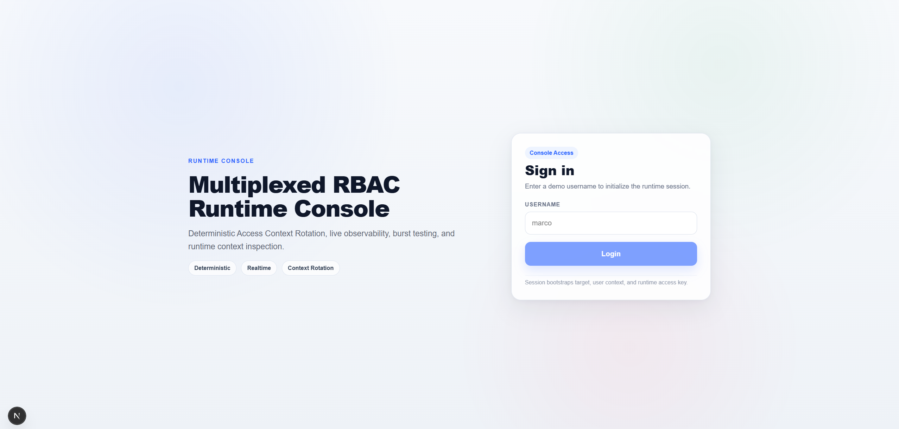
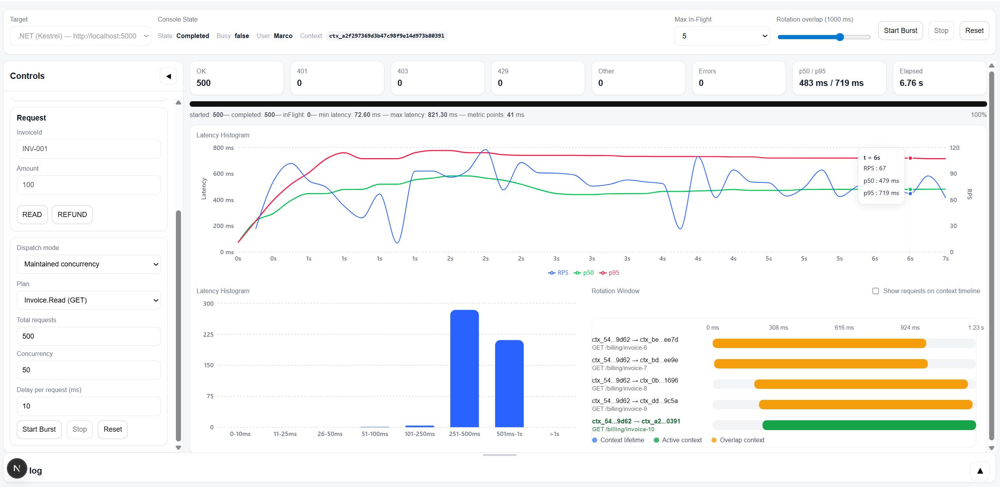
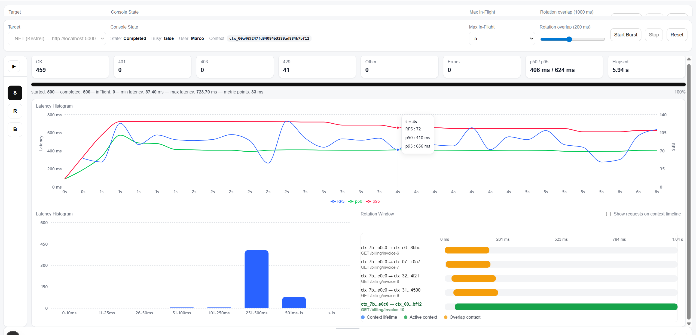
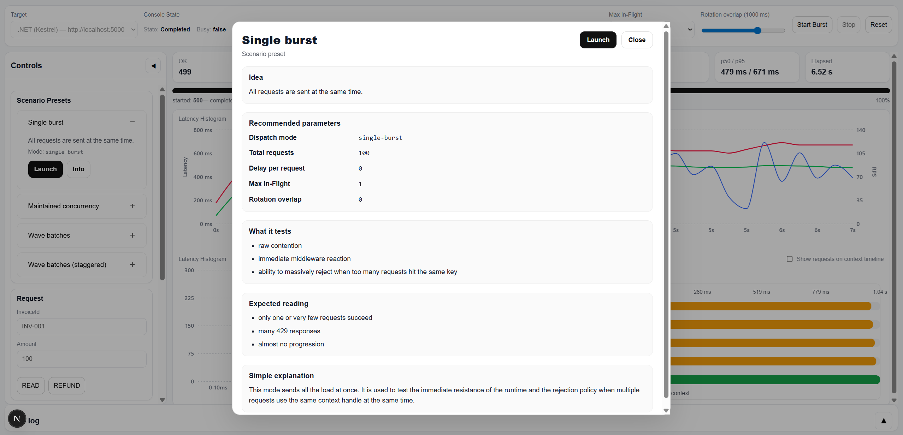
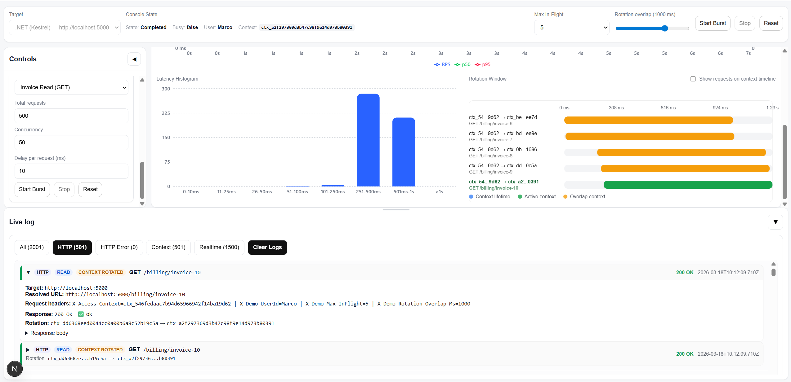

# Multiplexed Runtime — Deterministic Authorization & AI Execution

## Deterministic Authorization Runtime for High-Concurrency SaaS Systems

> A deterministic runtime designed to eliminate inconsistent authorization and execution behaviors in distributed systems.

Multiplexed RBAC is a **deterministic authorization runtime** built for large-scale, multi-tenant platforms operating under high concurrency.

It introduces a structured execution model based on:

- **Tenant Resource Names (TRN)**
- **distributed context rotation**
- **runtime-level enforcement**

This ensures that authorization decisions remain:

- consistent
- safe under concurrency
- fully observable
- independent from request lifecycles

---

Unlike traditional RBAC systems, this architecture:

- guarantees **deterministic permission evaluation**
- supports **safe concurrent request handling**
- enables **distributed authorization state**
- provides **real-time observability**
- remains **portable across runtimes**

---

This project extends these deterministic runtime principles beyond authorization into:

- distributed execution workflows
- AI-driven orchestration pipelines

forming a unified model for building **reliable, observable, and scalable runtime systems**.

---

### Key Capabilities

- 🔐 Deterministic authorization engine (TRN-based)
- 🔄 Distributed context rotation with atomic coordination (Redis + Lua)
- ⚡ High-concurrency safe execution model (in-flight protection)
- 📡 Real-time observability (SignalR / WebSocket)
- 🧪 Scenario-based load testing (burst, concurrency, wave patterns)
- 🧠 AI-ready runtime analysis (planned)
- 🧠 Deterministic AI execution engine (resumable, step-based orchestration)

---

> Designed for engineers building complex SaaS platforms where authorization must remain **correct, observable, and scalable under load**.

---

This repository provides a **reference implementation across multiple runtimes**, demonstrating how to build **observable, high-performance authorization layers**.

[](./CHANGELOG.md)
[](./CHANGELOG.md)


**This project is still under active development. Some features may be incomplete and UI or functional issues may occur.**
---

# Deterministic AI Execution Engine (in progress)

In addition to the RBAC runtime, this project introduces a **deterministic AI execution engine** designed for orchestrating AI workflows in a safe, resumable, and distributed-ready manner.

This engine is not a simple AI wrapper.

It provides a structured execution model similar to workflow engines, adapted for AI-driven pipelines.

## Core Concepts

### Execution Orchestration

- Step-based execution using `IAiStep`
- Sequential and resumable execution flows
- Multiple execution modes:
  - `ExecuteAsync(...)`
  - `ExecuteNextAsync(...)`
  - `ExecuteAllAsync(...)`

---

### Record / State Separation

The runtime separates orchestration from execution state:

- `AiExecutionRecord`
  - execution lifecycle
  - step tracking
  - status and progression

- `AiExecutionState`
  - mutable data
  - step inputs/outputs
  - metadata

This separation enables:

- clean replay and recovery
- distributed execution support
- safe state mutation without affecting orchestration logic

---

### Deterministic Execution Model

- Step transitions are validated using `ExecutionStepKey`
- Optimistic concurrency prevents race conditions
- Execution is designed to be:
  - idempotent
  - resumable
  - deterministic

---

### Context Isolation

Each AI execution runs inside an **AI-owned execution context**:

- cloned from the original request context
- persisted in the distributed context store
- rehydrated at each step execution

This guarantees:

- strict isolation
- consistent identity propagation
- no dependency on HTTP lifecycle

---

### Composite Execution Store

The AI runtime uses a composite persistence model:

- Redis (primary store)
- Memory fallback (resilience)

This enables:

- durable execution state
- safe recovery after failure
- distributed orchestration readiness

---

### Observability

Execution lifecycle is observable through:

- step start / success / failure logs
- structured realtime events
- integration with SignalR / WebSocket

---

## Positioning

This AI execution engine behaves similarly to:

- workflow engines (Temporal, Durable Functions)
- orchestration runtimes

But is specifically designed for:

- AI pipelines
- prompt orchestration
- tool chaining
- deterministic execution under load

---

## Why It Matters

Most AI integrations today are:

- non-deterministic
- tightly coupled to request lifecycles
- difficult to observe and debug

This runtime applies the same deterministic principles used in distributed systems to AI execution:

- controlled state transitions
- explicit execution flow
- resumable orchestration

Bringing reliability to AI workflows.

---

## AI Execution Flow

```text
Client Request
      │
      ▼
AI Orchestrator
      │
      ▼
Load / Create Execution Record
      │
      ▼
Resolve Execution Context
      │
      ▼
Execute Step (IAiStep)
      │
      ├──► Update Execution State
      │
      ├──► Persist (Redis / Memory)
      │
      └──► Emit Realtime Events
      │
      ▼
Next Step Decision
      │
      ├──► Continue
      └──► Complete
```

---

### What This Project Demonstrates

This repository is not just a library.

It is a **reference architecture** showing how to build:

- a **distributed authorization runtime**
- a **deterministic execution model**
- a **safe concurrency system**
- an **observable platform layer**
- a **deterministic AI execution runtime**
- a **resumable and distributed-ready workflow engine**

---

# Why Multiplexed RBAC?

Traditional RBAC implementations often break down in complex SaaS platforms due to:

* authorization logic becomes scattered across services
* permission evaluation becomes inconsistent
* cache invalidation becomes unsafe
* wildcard resource access becomes unpredictable

Multiplexed RBAC addresses these issues through:

* deterministic authorization evaluation
* context-aware permission enforcement
* distributed context rotation
* TRN resource addressing
* runtime enforcement layers
* service-to-service authorization support

---

# Core Concept: Tenant Resource Names (TRN)

Inspired by AWS ARN, TRN defines a deterministic resource format:

```
trn:<project>:<namespace>:<resource>:<feature>:<action>
```

Example:

```
trn:tev:crm:billing:invoice:read
```

This allows:

* namespace isolation
* deterministic authorization
* wildcard matching
* scalable multi-tenant resource addressing

---

# Authorization Architecture

```
## Execution Flow

Client / Service
      ↓
Authentication (JWT)
      ↓
Execution Context Resolution
      ↓
Context Middleware
      ↓
Composite Context Store (Redis + fallback)
      ↓
Namespace Guard
      ↓
Authorization Engine (TRN evaluation)
      ↓
Application Layer
```

The same model works for:

* APIs
* internal services
* workers
* service-to-service communication

---

# Architecture Overview

```
Client / Service
      │
      ▼
Authentication (JWT)
      │
      ▼
Execution Context Resolver
      │
      ▼
Context Middleware
      │
      ▼
Composite Context Store
 ┌───────────────┐
 │ Redis Store   │
 │ Lua Rotation  │
 └───────────────┘
      │
      ▼
Namespace Guard
      │
      ▼
TRN Authorization Engine
      │
      ▼
Application Layer
```

Key components:

* **Execution Context** — deterministic authorization state
* **Composite Context Store** — Redis + memory fallback
* **TRN Authorization Engine** — capability evaluation
* **Context Rotation** — safe key rotation across distributed systems

---

# Repository Structure

```
multiplexed-rbac
│
├─ implementations
│   └─ dotnet
│
├─ clients
│   └─ nextjs
│
├─ docs
│
└─ README.md
```

---

# How To Use

Typical lifecycle:

1. Resolve the **Execution Context**.
2. Store the context in Redis.
3. Return the **context key**.
4. Send the key with each request.
5. Rotate the key safely during requests.
6. Evaluate permissions via the **Authorization Engine**.

The runtime uses:

* **Redis** as distributed context store
* **atomic Lua scripts** to coordinate in-flight rotations
* an **in-memory fallback store** for resilience

The context key is transmitted using the HTTP header:

```
X-Access-Context
```

When rotation occurs, the **new key is returned in the same header**.

The client or calling service must always reuse the **latest returned key**.

In practice, the key may change **at each request depending on runtime configuration**.

---

# .NET Example

Below is a simplified example of building an Execution Context in C#.

```csharp
return new ExecutionContext
{
    ContextKey = "",
    Project = Project,
    TenantId = "tenant-id-xxxx",
    TenantGroupId = "tenant-group-id-xxx",
    CurrentNamespace = Namespace,
    UserId = userId,

    Namespaces = new List<NamespaceEntry>
    {
        new NamespaceEntry
        {
            Name = Namespace,
            Trns = new HashSet<string>
            {
                "trn:" + Project + ":crm:billing:invoice:read",
                "trn:" + Project + ":crm:billing:invoice:refund"
            }
        }
    },

    TtlSeconds = 300
};
```

Store the context:

```csharp
var contextKey = await _store.StoreAsync(ctx);
```

---

# Context Rotation Model

Multiplexed RBAC uses a **distributed rotational context store**.

The runtime stores authorization contexts in **Redis** and coordinates rotation using **atomic Lua scripts** to guarantee correctness when requests are in flight.

A **memory fallback store** is also available to improve resilience when the distributed layer is unavailable.

This allows the runtime to support:

* distributed authorization state
* safe in-flight context usage
* deterministic key rotation
* resilience through fallback behavior

The access context key is transmitted through the request header:

```
X-Access-Context
```

If rotation occurs, the **new key is returned in the response header**.

Clients must therefore always reuse the latest returned key.

---

# Runtime Options Example

```csharp
/// <summary>
/// Runtime configuration for the Multiplexed RBAC execution pipeline.
/// 
/// This class centralizes all runtime behaviors related to:
/// - access context transport
/// - session lifecycle
/// - context key rotation
/// - concurrency protection (anti-race / anti-replay)
/// 
/// These options are consumed primarily by:
/// - ExecutionContextMiddleware
/// - ContextStore implementations (InMemory / Redis)
/// </summary>
public sealed class ContextRuntimeOptions
{
    /// <summary>
    /// Header used to transmit the Access Context handle.
    /// 
    /// The client sends this header with each request, and the server
    /// may return a new value if the context key is rotated.
    /// </summary>
    public string AccessContextHeader { get; set; } = "X-Access-Context";

    /// <summary>
    /// Logical session idle timeout.
    /// 
    /// Determines when a session should be considered expired due
    /// to inactivity. This works alongside Redis TTL but represents
    /// the logical lifetime of a session.
    /// </summary>
    public TimeSpan SessionIdleTimeout { get; set; }
        = TimeSpan.FromMinutes(20);

    /// <summary>
    /// Enables automatic context key rotation at the end of a request.
    /// 
    /// Rotation helps mitigate replay risks and limits long-term
    /// reuse of context handles.
    /// </summary>
    public bool EnableRotation { get; set; } = true;

    /// <summary>
    /// Rotate the context key only when the response status code
    /// is below this threshold.
    /// 
    /// Default behavior: rotate only on successful responses (&lt; 400).
    /// </summary>
    public int RotateWhenStatusCodeBelow { get; set; } = 400;

    /// <summary>
    /// Default maximum number of concurrent in-flight requests allowed
    /// for a single access context key.
    /// 
    /// 1  = strict single-flight protection (recommended)
    /// n  = bounded concurrent reuse
    /// <= 0 = unlimited reuse (unsafe, demo/debug only)
    /// </summary>
    public int MaxInFlightPerContextKey { get; set; } = 10;

    /// <summary>
    /// Allows clients to override the MaxInFlightPerContextKey value
    /// using a request header.
    /// 
    /// This feature is intended only for testing or demo environments
    /// and should remain disabled in production.
    /// </summary>
    public bool AllowClientMaxInFlightOverride { get; set; } = false;

    /// <summary>
    /// Header name used by demo clients to request a custom max in-flight value.
    /// 
    /// Example:
    /// X-Demo-Max-InFlight: 5
    /// </summary>
    public string DemoMaxInFlightHeader { get; set; } = "X-Demo-Max-InFlight";

    /// <summary>
    /// Defines the behavior when the in-flight limit is exceeded.
    /// 
    /// Currently only the Reject policy is implemented.
    /// Future policies may allow waiting or queueing strategies.
    /// </summary>
    public InFlightOverflowPolicy OverflowPolicy { get; set; }
        = InFlightOverflowPolicy.Reject;

    /// <summary>
    /// HTTP status code returned when the in-flight limit
    /// for a context key is exceeded.
    /// 
    /// Default: 429 Too Many Requests.
    /// </summary>
    public int ConcurrentLimitExceededStatusCode { get; set; }
        = StatusCodes.Status429TooManyRequests;

    /// <summary>
    /// TTL used for Redis-based in-flight counters.
    /// 
    /// This protects against situations where a process crashes
    /// before releasing the counter. The TTL ensures that
    /// abandoned counters eventually expire.
    /// </summary>
    public TimeSpan InFlightCounterTtl { get; set; }
        = TimeSpan.FromSeconds(30);

    /// <summary>
    /// When enabled, the TTL of the in-flight counter is refreshed
    /// on each successful acquire operation.
    /// 
    /// This prevents expiration during long-running requests.
    /// </summary>
    public bool RefreshInFlightCounterTtlOnAcquire { get; set; } = true;

    /// <summary>
    /// Enables security logging when concurrency violations occur.
    /// 
    /// Useful for detecting replay attempts, misbehaving clients,
    /// or unexpected concurrent usage of the same context key.
    /// </summary>
    public bool LogConcurrencyViolations { get; set; } = true;

    /// <summary>
    /// Use Redis preload script and Sha caching
    /// </summary>
    public bool UseRedisLuaScriptShaCaching { get; set; } = true;

    /// <summary>
    /// Aloow to averlop rotation Window for testign purpose
    /// </summary>
    public bool AllowClientRotationOverlapOverride { get; set; } = true;

    /// <summary>
    /// Header used in demo mode to override the rotation overlap window.
    /// </summary>
    public string RotationOverlapWindowHeader { get; set; } = "X-Demo-Rotation-Overlap-Ms";

    /// <summary>
    /// Default overlap window applied after context rotation.
    /// </summary>
    public TimeSpan RotationOverlapWindow { get; set; } = TimeSpan.FromSeconds(10);
}
```

---

# Attribute-Based Authorization

```csharp
[Namespace("CRM")]
```

```csharp
[RequireCapability("invoice", "refund", "admin")]
```

Can be applied to:

* classes
* methods
* interfaces

Example:

```csharp
[RequireCapability("invoice","refund","admin")]
public Task RefundInvoice(string id)
```

---

# Realtime Logging & Observability (SignalR / WebSocket)

The runtime includes built-in support for **real-time observability** through:

* SignalR  
* WebSocket  (not fully tested)

This enables live streaming of:

* request lifecycle events  
* context rotation events  
* concurrency and in-flight tracking  
* authorization decisions  

---

## Background Worker Architecture

To guarantee zero impact on request performance, all observability events are processed through a **background worker pipeline**:

* events are pushed to a **non-blocking channel**  
* a **background worker consumes events asynchronously**  
* reducers process and transform events outside of the request pipeline  
* events are then dispatched to realtime providers (SignalR / WebSocket)  

This ensures:

* no blocking operations in the request hot path  
* constant request latency regardless of logging volume  
* safe handling of high-frequency event streams  

---

## Design Characteristics

* fully decoupled from HTTP request execution  
* cancellation-safe (graceful shutdown support)  
* pluggable transport providers  
* supports null provider (disabled mode fallback)  
* designed for high-throughput distributed environments  

---

## Key Benefit

This architecture allows the system to provide **high-fidelity, real-time observability** without compromising:

* performance  
* determinism  
* scalability  

Making it suitable for:

* load testing  
* debugging complex authorization flows  
* production-grade monitoring  

---

# Implementations

Current runtimes:

**.NET**
Reference runtime implementation.

**Next.js Client Runtime**
Used to simulate context rotation and stress test authorization.

Future runtimes:

* Java (Spring)
* Node.js
* Python

Future improvements:

* Wildcard rules TRN
* Distributed execution (worker-based orchestration)
* Retry and failure recovery strategies
* Step-level idempotency guarantees
* Advanced execution tracing and visualization
* Multi-provider AI integration (OpenAI, Claude, etc.)
* Prompt orchestration and tool chaining
* AI-assisted runtime analysis and optimization
---

# Requirements

To run the full sample and test the runtime behavior, the following dependencies must be installed and configured:

---

## Infrastructure

### Redis

- Used as the distributed context store
- Required for:
  - execution context storage
  - atomic rotation coordination (Lua scripts)
  - in-flight request tracking

---

### RabbitMQ

- Required for the event-driven sample using NServiceBus
- Enables testing of:
  - service-to-service authorization
  - asynchronous workflows
  - distributed message handling

---

## NServiceBus

- The sample uses **NServiceBus** for messaging

### License

- A **free trial license key** is required
- You can obtain it here:
  - https://particular.net/nservicebus

- Configure the license in your project (e.g. appsettings or code configuration)

---

## Notes

- Redis is mandatory for distributed context rotation behavior
- RabbitMQ + NServiceBus are required only for the event-driven sample scenario
- The API and client can still run without messaging, but full architecture validation requires all components

---

# How to Use the Sample and Next.js Client

## 1. Start the .NET sample API

Start the sample API project:

`MultiplexedRbac.Sample.Crm.Api`

This project simulates a login flow that seeds the distributed context store with the first rotation key.

Use:

`/demo/login`



This endpoint creates the initial execution context, stores it in the context store, and returns the first access context key.

That key must then be sent with subsequent requests through the header:

```
X-Access-Context
```

---

## 2. Test the sample API

The sample includes two authorization flows:

* **Controller → Service**
* **Controller → Event Service (NServiceBus)**

This demonstrates that the same authorization model can be enforced across synchronous and asynchronous service-to-service communication.

---

## 3. Start the Next.js client

Start the Next.js client runtime and open the UI.

The client allows you to:

* log in against the sample API
* store the access context key
* send manual requests
* generate burst request traffic

(The UI is provided only for testing purposes. While it can be further enhanced, it demonstrates how the architectural runtime layer remains fully decoupled from the React rendering layer.
It also showcases how to structure a React/Next.js client using dependency injection, state machines, and an event-driven architecture.)

---

## 4. Test rotation manually and under burst load

After logging in, use the client to:

* send manual requests
* trigger burst requests
* launch predefined scenarios
* observe context rotation in real time
* validate that authorization remains deterministic during rotation

---

### Advanced UI Controls (Testing & Demo)

The client interface now exposes runtime tuning capabilities for advanced testing:

* **Max In-Flight Control**
  * Dynamically adjust the maximum number of concurrent requests per context
  * Simulates contention and concurrency limits
  * Helps validate rejection policies and system stability under load

* **Rotation Overlap Window**
  * Configure the overlap duration between old and new context keys
  * Enables testing of race conditions during key rotation
  * Ensures safe transition between rotated contexts

* **Scenario Launcher**
  * Execute predefined load patterns:
    * Single burst
    * Maintained concurrency
    * Wave-based batching
  * Allows reproducible and deterministic stress testing
  * Provides better insight into system behavior under different traffic models

---

### Observability & Visualization

The interface provides real-time visibility into:

* context key lifecycle and rotation flow
* request distribution and concurrency behavior
* in-flight request tracking per context
* rejection patterns and overflow handling
* live logs and event streaming (WebSocket / SignalR)


> - rotation graph



> - concurrency behavior



> - scenario execution




> - real-time logs



---

### What Burst Testing Demonstrates

Burst and scenario-based testing validate that:

* in-flight requests remain safe during rotation
* Redis Lua scripts guarantee atomic coordination
* rotated keys propagate correctly via `X-Access-Context`
* concurrency limits are properly enforced (Max In-Flight)
* rotation overlap prevents race-condition failures
* authorization remains deterministic even under repeated and high-frequency requests
---

# Medium Technical Article Series

Designing IAM-Aligned Authorization for Multiplexed SaaS

https://medium.com/@m.marano2k14/designing-iam-aligned-authorization-for-multiplexed-multi-tenant-saas-b1125696bcb1

Multiplexed RBAC in .NET — Part 1

https://medium.com/@m.marano2k14/multiplexed-rbac-in-net-part-1-application-layer-0f980108cec0

Multiplexed RBAC in .NET — Part 2

https://medium.com/@m.marano2k14/multiplexed-rbac-in-net-part-2-distributed-rotational-cache-with-redis-lua-28674649ff16

Multiplexed RBAC in .NET — Part 3

https://medium.com/@m.marano2k14/multiplexed-rbac-in-net-part-3-9c3b6beda007

Multiplexed RBAC in .NET — Part 4

https://medium.com/@m.marano2k14/multiplexed-rbac-in-net-part-4-deterministic-trn-authorization-engine-7605c934852a

---

# Why This Architecture Matters

Authorization is one of the most fragile parts of large-scale SaaS platforms.

Most implementations suffer from:

* scattered permission logic
* unsafe cache invalidation
* inconsistent permission evaluation
* difficult service-to-service enforcement

Multiplexed RBAC introduces a **deterministic authorization runtime** separating:

* authentication
* authorization context
* permission evaluation
* distributed state management

By modeling authorization using **TRN (Tenant Resource Names)** and **rotational execution contexts**, the system ensures authorization remains:

* deterministic
* scalable
* safe across distributed systems

This project extends these principles beyond authorization into AI execution, demonstrating how deterministic runtime models can be applied to orchestrate complex AI workflows safely and consistently.

---

# Goals

* deterministic authorization architecture
* portable authorization model across languages
* reference architecture for SaaS platforms
* production-grade authorization patterns

---

# Typical Use Cases

Multiplexed RBAC is designed for complex distributed systems such as:

* multi-tenant SaaS platforms
* microservice architectures
* internal service-to-service authorization
* distributed API platforms
* event-driven architectures
* platform engineering environments

Typical industries include:

* HRTech platforms
* FinTech platforms
* enterprise SaaS ecosystems
* cloud-native platforms

---

# License

MIT
